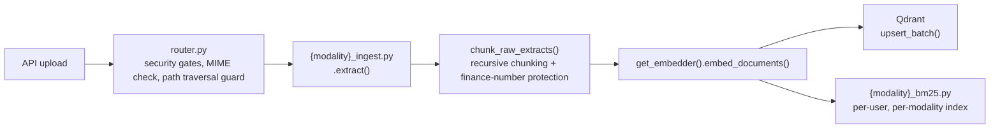
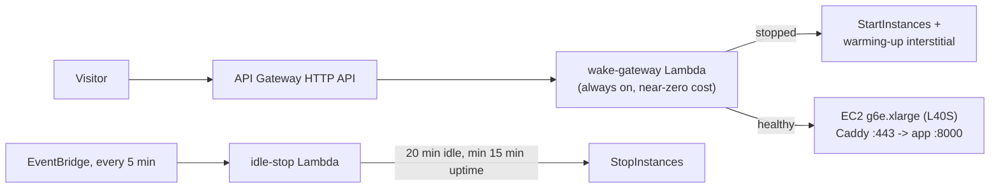

# MAGIK — Multimodal Agentic RAG Integrated Knowledge Assistant

**A production-grade, finance-domain retrieval-augmented generation system** that ingests text, PDF, DOCX, XLSX, images, audio, and video, routes queries through an agentic controller, retrieves with a hybrid BM25 + dense pipeline, verifies its own answers before they reach the user, and runs entirely on open-source models — no third-party LLM API required.

[](https://github.com/vjkarthik98/multimodal-rag-assistant/actions/workflows/ci.yml)
[](https://github.com/vjkarthik98/multimodal-rag-assistant/actions/workflows/eval-gate.yml)
[](https://github.com/vjkarthik98/multimodal-rag-assistant/actions/workflows/cd.yml)
[](https://github.com/vjkarthik98/multimodal-rag-assistant/actions/workflows/security.yml)
[](https://github.com/vjkarthik98/multimodal-rag-assistant/actions/workflows/quality.yml)
[](LICENSE)
[](pyproject.toml)

**Live demo:** [magik.vk-ai.online](https://magik.vk-ai.online)

The demo runs on a scale-to-zero AWS GPU box — it may take 60-90 seconds to wake up from a cold stop on the first request. See [Deployment](#deployment) for why.

---

## Table of Contents

- [Overview](#overview)
- [Why This Project Exists](#why-this-project-exists)
- [Key Features](#key-features)
- [Architecture](#architecture)
- [Per-Modality Isolation](#per-modality-isolation)
- [Tech Stack](#tech-stack)
- [Project Structure](#project-structure)
- [Getting Started](#getting-started)
- [API Reference](#api-reference)
- [Evaluation & Quality Gates](#evaluation--quality-gates)
- [Security & Guardrails](#security--guardrails)
- [Testing](#testing)
- [CI/CD](#cicd)
- [Quality & Performance Reports](#quality--performance-reports)
- [Deployment](#deployment)
- [Observability](#observability)
- [Known Limitations & Roadmap](#known-limitations--roadmap)
- [License](#license)
- [Author](#author)

---

## Overview

MAGIK is a full-stack RAG system built around a single premise: **most RAG demos fall apart under the exact conditions production traffic creates** — malformed documents, adversarial input, numbers that get silently rounded, sessions from other users bleeding into context, judges that inflate their own scores. This repository is an attempt to build one that does not, and to prove it with a real evaluation harness rather than a claim.

It specializes in **financial documents** — earnings calls, 10-K/10-Q filings, spreadsheets of financial ratios, investor presentations — because finance is an unforgiving domain for RAG: a hallucinated number is worse than a hallucinated sentence. The system enforces verbatim numeric fidelity between retrieved context and generated answers, and gates its own CI on that guarantee.

Everything runs locally: a quantized GGUF LLM via `llama.cpp`, open embedding and reranking models, open OCR/ASR/vision models. There is no OpenAI, Anthropic, or other paid LLM API in the request path.

## Why This Project Exists

Most RAG tutorials stop at "chunk it, embed it, retrieve it, prompt it." That gets a demo working; it does not get a system through a security review, a load test, or a finance team asking "prove this number is real." MAGIK exists to work through the parts that tutorials skip:

- What happens when the router misclassifies a query — is there a fallback, or does it just fail?
- What happens when a chunk's number gets truncated mid-context — does the model make one up to fill the gap?
- What happens when a prompt-injection payload is embedded inside an ingested PDF, not typed by the user?
- What happens when two tenants' data lives in the same vector collection?
- How do you know retrieval quality didn't regress when you changed the chunking strategy — a passing test suite won't tell you.

Each of the sections below exists because one of these questions had a real, sometimes embarrassing answer during development — documented in full in [`CHANGELOG.md`](CHANGELOG.md).

## Key Features

**Multimodal ingestion** — seven independent pipelines (text, PDF, DOCX, XLSX, image, audio, video), each with dedicated extraction, chunking, embedding, and BM25 indexing code. A bug in the XLSX pipeline cannot break the audio pipeline; they share no per-modality state.

**Agentic query routing** — an `AgentController` classifies every query into `rag`, `web`, `hybrid_web`, `direct`, or a finance-specific tool call (`financial_calculator`, `sec_edgar_search`) before deciding how to answer it, under an enforced timeout and token budget.

**Hybrid retrieval** — BM25 (finance-aware tokenizer) and dense Qdrant search are fused, then reranked with a cross-encoder (`BGE-reranker-large`) and diversified with MMR. Cross-modal search (text query against image/video content) goes through a separate SigLIP text encoder.

**Self-verifying answers** — before an answer is streamed to the client, a verification loop checks groundedness (are claims supported by retrieved context?) and citation accuracy (do citations point at real chunks?), retrying with an expanded retrieval strategy on failure, bounded by a hard timeout.

**Numeric fidelity guarantees** — financial figures in a generated answer are checked against the literal text of retrieved chunks with a 0.5% tolerance and no unit-scale bridging. This is gated in CI, not just measured.

**Guardrails against adversarial input** — every text surface across all 28 modality x layer combinations is sanitized through a single injection-detection entry point before it reaches a model. 100% recall (64/64) against an adversarial corpus, 0.9% false-positive rate, all 10 OWASP LLM Top 10 (2025) categories addressed.

**Real authentication, not a demo login** — JWT (HS256) access/refresh tokens, Argon2 password hashing, Google OAuth (PKCE), TOTP MFA, a Redis-backed token blacklist for logout/revocation, and sliding-window rate limits.

**Enforced tenant isolation** — every one of the four data layers (Qdrant, BM25, Redis, MongoDB) filters on `user_id` independently. There is no layer where isolation is "handled upstream."

**Conversation memory** — short-term memory in Redis, persistent history in MongoDB, and automatic summarization to keep long conversations within the LLM's context budget.

**Full observability stack** — structured JSON logs, Prometheus metrics, OpenTelemetry traces, Grafana dashboards, Loki log aggregation, Tempo distributed tracing, and alerting — not just a `/health` endpoint.

**A real evaluation harness** — ten evaluation suites (retrieval, generation, hallucination, finance, OCR, audio, video, routing, e2e, verification) with regression thresholds derived from measured production baselines, wired into CI as a merge gate.

**Cost-aware GPU deployment** — the production system runs on a single AWS GPU instance that stops itself after 20 minutes of idle traffic and wakes on the next request, cutting infrastructure cost by roughly two orders of magnitude versus an always-on box.

## Architecture

### Query flow

```mermaid
flowchart LR
    U["User query"] --> AC["Agent Controller<br/>(timeout + token-budget cap)"]
    AC --> AR["Agent Router<br/>classifies: rag / web / hybrid_web / direct / finance_*"]
    AR --> AE["Agent Executor<br/>(single classify+dispatch)"]
    AE --> TR["Tool Registry"]
    TR --> HR["Hybrid Retriever<br/>BM25 + Qdrant fusion"]
    HR --> RR["CrossEncoder Rerank + MMR"]
    RR --> PB["Prompt Builder<br/>(context + memory fusion)"]
    PB --> LLM["Qwen2.5-14B-Instruct<br/>GGUF via llama.cpp"]
    LLM --> VL["Verification Loop<br/>groundedness + citations, retry on fail"]
    VL --> OG["Output Guard"]
    OG --> SSE["SSE stream to client"]
```



`AgentDecision` carries filter hints (`modality_hint`, `call_section_filter`, `source_type_filter`) through to the Qdrant query. The verification loop retries with an expanded retrieval strategy when groundedness or citation checks fail, bounded by `AGENT_VERIFY_TIMEOUT_SEC`.

### Ingestion flow



Audio and video ingestion return a `job_id` immediately and run as a background task; the client polls `GET /rag/ingestion/status/{job_id}` for progress.

### Layered design

| Layer | Responsibility |
|---|---|
| Frontend | React + Vite + Tailwind SPA |
| API | FastAPI routers (`/rag`, `/auth`, `/admin`) |
| Agents | Query classification, tool dispatch, bounded execution |
| Retrieval | BM25 + Qdrant hybrid search, cross-encoder rerank, MMR |
| Verification | Groundedness, citation accuracy, confidence scoring, bounded retries |
| Guardrails | Input sanitization, output checks, PII/SSRF/jailbreak defenses, audit logging |
| Memory | Redis (short-term) + MongoDB (persistent) + summarization |
| LLM | GGUF inference via a separate `llama-server` process |
| Auth | JWT + Argon2 + OAuth + MFA, enforced at every data-layer boundary |
| Observability | structlog, Prometheus, OpenTelemetry, Grafana/Loki/Tempo |
| Infrastructure | Docker, AWS EC2 GPU, Lambda-driven scale-to-zero |

## Per-Modality Isolation

The defining structural decision in this codebase: every modality owns exactly four files, one per processing layer, with no shared per-modality state. A bug in one modality's file cannot break another's.

| Modality | Ingestion (`app/ingestion/`) | Chunking (`app/chunking/`) | Embedding (`app/embeddings/`) | BM25 (`app/bm25/`) |
|---|---|---|---|---|
| Text | `txt_ingest.py` | `txt_chunker.py` | `txt_embedder.py` | `txt_bm25.py` |
| PDF | `pdf_ingest.py` | `pdf_chunker.py` | `pdf_embedder.py` | `pdf_bm25.py` |
| DOCX | `docx_ingest.py` | `docx_chunker.py` | `docx_embedder.py` | `docx_bm25.py` |
| XLSX | `xlsx_ingest.py` | `xlsx_chunker.py` | `xlsx_embedder.py` | `xlsx_bm25.py` |
| Image | `image_ingest.py` | `image_chunker.py` | `image_embedder.py` | `image_bm25.py` |
| Audio | `audio_ingest.py` | `audio_chunker.py` | `audio_embedder.py` | `audio_bm25.py` |
| Video | `video_ingest.py` | `video_chunker.py` | `video_embedder.py` | `video_bm25.py` |

The pipeline never imports a per-modality file directly — it dispatches through a public API that lazy-loads the right implementation: `chunk_raw_extracts()`, `get_embedder(modality)`, and `router.py`'s `INGESTOR_MAP` / `detect_modality()`. Shared logic (sanitization, the BGE embedder singleton, finance-number protection, the BM25 circuit breaker) lives in per-layer base classes, not in the per-modality files themselves.

## Tech Stack

**Backend** — FastAPI, Pydantic v2, Uvicorn, SSE (`sse-starlette`) for streaming responses.

**LLM inference** — `llama.cpp` (`llama-cpp-python`), running as a separate `llama-server` process. Default model: **Qwen2.5-14B-Instruct**, Q4_K_M GGUF quantization.

**Embeddings & retrieval** — `BAAI/bge-large-en-v1.5` (dense embeddings), `BAAI/bge-reranker-large` (cross-encoder reranking), `google/siglip-so400m-patch14-384` (cross-modal text/image search), `rank-bm25` with a finance-aware tokenizer, Qdrant (vector store).

**Vision** — Qwen2-VL (7B for images, 2B for video frames) for captioning; Tesseract + EasyOCR + TrOCR for OCR; a deterministic OpenCV digitizer for extracting values from financial charts.

**Audio** — `faster-whisper` (`large-v3`) for transcription, `pyannote.audio` (`speaker-diarization-3.1`) for diarization.

**Memory & storage** — Redis (short-term working memory + hot-path cache), Upstash Redis (production long-term memory), MongoDB (persistent chat history).

**Auth & security** — `python-jose` (JWT), `passlib[argon2]`, `authlib` (Google OAuth PKCE), `pyotp` (TOTP MFA), Presidio (PII detection), ClamAV (`clamd`/`pyclamd`), `bleach`.

**Observability** — `structlog`, `prometheus-client`, OpenTelemetry (API/SDK/OTLP exporter), Grafana, Loki, Tempo.

**Evaluation** — a custom harness (`app/eval/`) with `ragas`, `jiwer` (WER/CER), `mlflow`; a single self-hosted judge (Qwen2.5-7B-Instruct) backs the Tier-2 gate, the RAGAS report, and DeepEval, with a pure-Python lexical fallback if it's unavailable.

**Frontend** — React 19, Vite, Tailwind CSS, `react-markdown` + `remark-gfm` for rendering tables and formatted answers.

**Dev tooling** — Ruff, Black, isort, mypy (strict-optional), pytest (+ asyncio, cov, timeout, randomly), pre-commit, `detect-secrets`, Bandit, `pip-audit`.

**Infrastructure** — Docker (multi-stage: CUDA build, CUDA runtime, CPU-only dev runtime), Docker Compose, AWS EC2 (GPU), AWS Lambda + API Gateway + EventBridge (scale-to-zero), GitHub Actions, Caddy (HTTPS reverse proxy).

## Project Structure

```
multimodal-rag-assistant/
├── app/
│   ├── agents/          # Query classification, routing, bounded execution, tool registry
│   ├── api/              # FastAPI route definitions and middleware
│   ├── auth/              # JWT, Argon2, Google OAuth, TOTP MFA, tenant isolation, admin routes
│   ├── bin/               # Model download/provisioning scripts
│   ├── bm25/              # Per-modality BM25 indexes + shared base class
│   ├── chunking/          # Per-modality chunkers + finance-number protection
│   ├── core/              # Settings, device manager, model loader/registry, startup validation
│   ├── embeddings/        # Per-modality embedders + shared BGE singleton
│   ├── eval/              # Evaluation harness: runners, judges, metrics, gold datasets, thresholds
│   ├── guardrails/        # Input/output sanitization, jailbreak/PII/SSRF defenses, audit log
│   ├── ingestion/         # Per-modality extraction + security-gated router
│   ├── llm/               # GGUF model interface (proxies to llama-server)
│   ├── memory/            # Redis + MongoDB conversational memory, summarization
│   ├── pipeline/          # Ingestion pipeline, query pipeline, streaming RAG pipeline
│   ├── prompt/             # Prompt construction
│   ├── reasoning/         # Query decomposition, context/memory fusion
│   ├── retrieval/          # BM25 retriever, hybrid retriever, reranker
│   ├── tools/               # Web search and other agent-callable tools
│   ├── utils/               # Logging, networking, path utilities
│   ├── vectorstore/        # Qdrant client wrapper
│   ├── verification/       # Groundedness, citation, confidence, retry-controlled answer verification
│   └── main.py             # FastAPI application entry point
│
├── ui/                      # React + Vite + Tailwind frontend (never imports from app/)
│   └── src/{api,components,context,hooks,pages,utils}/
│
├── tests/                   # 99 test files
│   ├── unit/                # Fast, mocked, no external services — mirrors app/ structure
│   ├── auth/                 # JWT, MFA, tenant isolation, admin, GDPR purge
│   ├── guardrails/            # Red-team injection/jailbreak/SSRF/PII suite
│   ├── integration/           # Live Qdrant/Redis/Mongo required
│   ├── eval/                  # Eval-harness correctness tests
│   ├── pipeline/               # End-to-end pipeline behavior
│   └── video/                  # Video-modality end-to-end test
│
├── docs/
│   ├── runbooks/              # CI/CD, deployment, and monitoring runbooks
│   └── EVAL_*.md              # Per-modality evaluation write-ups
│
├── monitoring/                 # Prometheus, Grafana, Loki, Tempo, OTel collector, alert rules
├── deploy/aws/                  # Lambda wake/idle-stop, IAM policies, Caddy config, deploy scripts
├── scripts/                      # Accuracy benchmarks and quality audits per modality
├── data/                          # Runtime state (BM25 indexes, uploads) — gitignored
├── notebooks/                      # Experimentation
│
├── docker-compose.yml               # Local CPU-only dev stack (API + Qdrant + Redis + Mongo)
├── docker-compose.monitoring.yml    # Prometheus/Grafana/Loki/Tempo/OTel stack
├── Dockerfile                        # Multi-stage: CUDA build, CUDA runtime, CPU dev-runtime
├── Makefile                           # install, lint, test, eval, docker, release targets
├── start_server.py                     # Cross-platform launcher (auto-detects CPU vs CUDA)
├── pyproject.toml / requirements.txt
├── CHANGELOG.md                         # Full version history with root-caused bug write-ups
└── LICENSE
```

## Getting Started

### Try it live

The fastest way to see the system working end to end is [magik.vk-ai.online](https://magik.vk-ai.online) — no setup required. First request after idle may take 60-90 seconds while the GPU box wakes.

### Run it locally

**Prerequisites:** Python 3.10+, Docker, Node.js 20.19+ (for the UI — required by Vite 8), FFmpeg, Tesseract OCR.

```bash
git clone https://github.com/vjkarthik98/multimodal-rag-assistant.git
cd multimodal-rag-assistant

cp .env.example .env          # fill in secrets — see .env.example for what's required
make install-dev              # runtime + lint/type/test tooling
make compose-up                # API + Qdrant + Redis + Mongo, CPU-only dev stack
```

This brings up the API against a local CPU-only stack — enough to exercise health, auth, and routing logic without downloading model weights. To run the full multimodal pipeline (ingestion, retrieval, generation):

```bash
python app/bin/models/download_all_models.py   # one-time, ~25.2GB into .hf_cache/ (17 models)
python start_server.py                          # auto-detects CPU vs CUDA, launches llama-server + API
```

### Run the UI

```bash
cd ui
npm install
npm run dev       # dev server on http://localhost:5173
```

### Common Makefile targets

```bash
make lint               # Ruff + black --check + isort --check
make typecheck            # mypy over app/
make test-unit              # fast unit tests, no external services
make test-guardrails         # red-team injection/guardrail suite
make eval-retrieval           # Tier-1 eval gate (retrieval only, no LLM)
make eval-full                 # Tier-2 eval (full generation + judge suite, needs a live server)
make docker-build                # production CUDA image
make compose-down                 # tear down the local dev stack
```

Run `make help` for the complete, current list.

## API Reference

All routes are documented live at `/docs` (Swagger UI) when the server is running. The tables below reflect the routes as they exist in `app/api/api_routes.py`, `app/auth/router.py`, and `app/auth/admin_router.py`.

### RAG (mounted at `/rag`)

| Method | Path | Purpose |
|---|---|---|
| POST | `/rag/query` | Single-shot query, full response |
| POST | `/rag/query/stream` | Streaming query via Server-Sent Events |
| POST | `/rag/upload` | Upload a document for ingestion |
| POST | `/rag/ingest` | Trigger ingestion directly |
| GET | `/rag/ingestion/status/{job_id}` | Poll background ingestion status (audio/video) |
| GET | `/rag/knowledge-base` | List ingested files |
| DELETE | `/rag/knowledge-base/{filename}` | Delete a file and its indexed data |
| GET | `/rag/sessions` | List chat sessions |
| GET / DELETE | `/rag/sessions/{session_id}` | Get or delete a specific session |
| PATCH | `/rag/sessions/{session_id}` | Rename/update a session |
| POST | `/rag/memory/clear`, `/rag/memory/purge` | Clear or purge conversational memory |
| POST | `/rag/feedback` | Submit answer feedback |
| GET | `/rag/health`, `/rag/infra/health`, `/rag/models/health` | Health checks |
| GET | `/rag/tools` | List available agent tools |

### Auth (mounted at `/auth`)

| Method | Path | Purpose |
|---|---|---|
| POST | `/auth/register` | Create an account |
| POST | `/auth/login` | Email/password login |
| GET | `/auth/google`, `/auth/callback/google` | Google OAuth (PKCE) flow |
| POST | `/auth/verify-otp`, `/auth/resend-otp` | Email OTP verification |
| POST | `/auth/mfa/enroll`, `/auth/mfa/verify`, `/auth/mfa/disable` | TOTP MFA lifecycle |
| POST | `/auth/refresh` | Refresh an access token |
| POST | `/auth/logout`, `/auth/logout-all` | Revoke the current or all refresh tokens |
| POST | `/auth/forgot-password`, `/auth/reset-password` | Password reset flow |
| GET | `/auth/me` | Current user profile |
| DELETE | `/auth/me` | Self-service account deletion (GDPR) |

### Admin (mounted at `/admin`, requires `role=admin`)

| Method | Path | Purpose |
|---|---|---|
| GET | `/admin/users`, `/admin/users/{user_id}` | List or inspect users |
| PATCH | `/admin/users/{user_id}/role`, `/admin/users/{user_id}/status` | Promote/demote, activate/deactivate |
| DELETE | `/admin/users/{user_id}` | GDPR purge of a user's data |
| GET | `/admin/system/health`, `/admin/system/audit`, `/admin/stats` | Platform health, audit log, usage stats |

Prometheus metrics are served on a dedicated port (`PROMETHEUS_PORT`, default `9464`), separate from the API port — not exposed as a JSON route.

## Evaluation & Quality Gates

RAG quality is treated as a regression-tested contract, not a one-time benchmark. `app/eval/` runs ten suites against gold datasets, and `thresholds.yaml` defines a minimum/maximum for each metric with a written rationale (`why:`) — no threshold exists without a documented reason.

```bash
python -m app.eval.run --suite all                              # full suite
python -m app.eval.run --suite retrieval                        # retrieval only, no LLM required
python -m app.eval.run --suite all --gate                       # CI gate mode — exits 1 on regression
python -m app.eval.run --query "What was Q3 revenue?" --debug   # single-query debug
```

### Retrieval (CI-gated)

Measured on the production box (AWS g6e.xlarge / L40S), n=56 gold queries, 2026-07-28. This is the only suite currently wired as a hard merge gate — every other suite below is informational until it has an equivalent live-box baseline.

| Metric | Baseline | Gate (baseline x 0.95) |
|---|---|---|
| Recall@5 | 0.509 | ≥ 0.484 |
| Recall@10 | 0.554 | ≥ 0.526 |
| MRR | 0.356 | ≥ 0.338 |
| nDCG@10 | 0.402 | ≥ 0.382 |
| Hit Rate | 0.679 | ≥ 0.645 |
| p50 / p95 latency | 0.14s / 0.23s | — |

### Generation, finance, and routing (informational, real numbers)

| Metric | Threshold | Note |
|---|---|---|
| Faithfulness | ≥ 0.25 | CrossEncoder + GGUF hybrid judge |
| Context recall | ≥ 0.95 | Baseline: 1.00 |
| Citation accuracy | ≥ 0.95 | Baseline: 1.00 |
| Finance numeric fidelity | ≥ 0.95 | Verbatim number match, 0.5% tolerance, no unit-scale bridging |
| Routing accuracy | ≥ 0.917 | Baseline: 12/12 correct |
| p95 end-to-end latency | ≤ 60s | Production-observed ceiling |

### Per-modality accuracy, measured after targeted fixes

| Modality | Key result |
|---|---|
| Text | Retrieval hit rate 1.00, finance fidelity 0.875 |
| PDF | Finance fidelity 0.929 |
| DOCX | Retrieval hit rate 0.79 to 1.00 after fixing a structural-embedding bug |
| XLSX | Retrieval hit rate 0.29 to 0.64; answer correctness 0.00 to 0.79 |
| Image (charts) | Answer correctness 0.29 to 0.86 with a deterministic chart digitizer |
| Audio | Answer correctness 0.20 to 0.38 after scoping retrieval to the correct meeting |
| Video | Answer correctness 0.07 to 0.41 after scoping retrieval to the correct call |

Full write-ups per modality live in `docs/EVAL_*.md`; the harness itself is documented in [`app/eval/README.md`](app/eval/README.md).

## Security & Guardrails

- **Prompt injection defense**: a single sanitization entry point (`input_guard.sanitize()`) covers all 28 modality x layer combinations, with 43 severity-tiered detection patterns.
- **Adversarial corpus results**: 64/64 (100%) recall on a 109-case red-team corpus spanning injection, jailbreak, encoding bypass, PII exposure, SSRF, and poisoned-document attacks; 0.9% false-positive rate; F1 = 0.994.
- **OWASP LLM Top 10 (2025)**: all 10 categories addressed.
- **Output guarding**: every LLM response is checked before it reaches the client, including a hallucination-notice fallback path for web-sourced answers that bypass the verification loop.
- **Tenant isolation**, enforced independently at all four data layers: Qdrant (typed filter on `user_id`), BM25 (per-user index file), Redis (namespaced keys), MongoDB (query-level filter).
- **Authentication**: JWT (HS256) access/refresh tokens, Argon2 password hashing, Google OAuth via PKCE, TOTP MFA, a Redis-backed token blacklist so logout actually revokes access, and sliding-window rate limiting.
- **Secrets management**: production secrets (JWT signing keys, DB credentials, API keys) are stored in AWS SSM Parameter Store as SecureStrings, fetched fresh on deploy, written to a `0600` file, and never committed.
- **Test coverage**: 257 guardrail tests passing, 0 failures.

## Testing

```bash
pytest tests/unit/ -m unit -q                # fast unit tests, no external services
pytest tests/guardrails/ -v                   # red-team injection/guardrail suite
pytest tests/auth/ -v                          # tenant isolation / auth suite
pytest tests/ -m "not slow" --ignore=tests/integration/test_document_pipeline.py -q
```

Always scope pytest to a specific subdirectory (`tests/unit/`, `tests/auth/`, `tests/guardrails/`) rather than running bare `pytest tests/ -m <marker>` — pytest collects every file under `testpaths` regardless of marker filtering, and one broken file under `tests/integration/` is enough to abort collection for the entire run.

99 test files across seven categories: unit (mirrors `app/`'s module structure), auth, guardrails, integration (requires live Qdrant/Redis/Mongo), eval-harness correctness, pipeline, and a dedicated video end-to-end suite.

## CI/CD

| Workflow | Trigger | What it does |
|---|---|---|
| `ci.yml` | Every push/PR | Lint (Ruff/Black/isort), mypy, unit tests — fast and hermetic, no models or GPU |
| `eval-gate.yml` | Every PR (Tier-1) + self-hosted GPU runner (Tier-2) | Tier-1: retrieval-only regression gate, CPU, blocks merge. Tier-2: full generation + LLM-judge suite against the live production box |
| `cd.yml` | Tag push (`v*`) | Builds the production image, pushes to GHCR, deploys via SSM, health-checks, auto-rolls back on failure |
| `release.yml` | Manual dispatch | Syncs version files, tags, publishes a GitHub Release |
| `security.yml` | Push/PR + weekly cron | Secret scanning (`detect-secrets`), dependency CVEs (`pip-audit`), SAST (Bandit), container scanning |
| `quality.yml` | Every PR touching `app/api/`, `ui/`, auth, or `perf/k6/` | API contract (Schemathesis), k6 smoke, OWASP ZAP baseline (DAST), Lighthouse — all against the local docker-compose stack. Informational, not a required check yet — see `quality-reports/README.md` |
| `quality-live.yml` | Manual dispatch only | The live-mode equivalents (RAGAS, DeepEval, k6, Lighthouse, ZAP baseline) against the real deployed URL — never scheduled, never on push/PR |

`cd.yml` authenticates to AWS via GitHub OIDC — there are no long-lived AWS credentials stored in the repository.

## Quality & Performance Reports

A dedicated testing initiative on top of the eval harness above: API contract
testing, a second LLM-eval framework, load/stress testing, browser
performance, DAST, and passive uptime monitoring — all open-source, all
designed around two constraints specific to this deployment: a single
wake-on-demand GPU box (never woken by monitoring itself) and real,
IP-keyed rate limits (tooling never contends with real visitor traffic).
Full design rationale in `quality-reports/README.md`.

| Ask | Tool | Local (automatic, every PR) | Live (manual, real deployed URL) |
|---|---|---|---|
| API testing | [Schemathesis](https://schemathesis.readthedocs.io/) | ✅ `quality.yml` | `make -f Makefile` → `scripts/schemathesis_live.sh` |
| RAGAS | [Ragas](https://github.com/explodinggradients/ragas) `0.1.21` | `make ragas-report` | ✅ default mode — `app/eval/ragas_report.py` |
| DeepEval | [DeepEval](https://github.com/confident-ai/deepeval) (local GGUF judge, never OpenAI) | `make deepeval-report` | ✅ default mode — `app/eval/deepeval_suite.py` |
| Stress / performance | [k6](https://k6.io/) | ✅ smoke only, `quality.yml` | `perf/k6/live_profile.js` (manual) |
| Multi-user simulation | k6, dedicated test tenants | `make k6-multiuser` | `perf/k6/multi_user_tenant.js` — asserts **zero cross-tenant leakage** under concurrent load |
| Browser performance | [Lighthouse](https://github.com/GoogleChrome/lighthouse) / Lighthouse CI | ✅ `quality.yml` | manual, real Core Web Vitals |
| Security scan (DAST) | [OWASP ZAP](https://www.zaproxy.org/) | ✅ baseline (passive), `quality.yml` | baseline safe any time; **active scan is a local, human-supervised script only** — never CI, see `security/zap/README.md` |
| Uptime monitoring | [Uptime Kuma](https://github.com/louislam/uptime-kuma) | — | passive push from the wake/idle-stop Lambdas themselves; Kuma never polls the app (that would wake it) — see `monitoring/uptime-kuma/README.md` |

Reports land in `quality-reports/<tool>/` (tracked in git — unlike `docs/`,
this directory exists specifically to be visible on GitHub and linkable from
here and the portfolio site). `scripts/generate_quality_badges.py` turns the
latest committed report per tool into shields.io badges.

This is freshly built tooling, not yet run against the live deployment — the
Local/Live columns above describe what each tool does and how to run it, not
a claim that numbers already exist. Real scores appear in `quality-reports/`
and as badges once each tool has actually been run and a report committed.

## Deployment

The production system runs on a single AWS GPU instance that is **stopped by default** and wakes on demand, rather than an always-on box.



- Always-on `g6e.xlarge` (NVIDIA L40S, 48GB VRAM): roughly **$1,340/month**.
- Stopped-by-default with this gateway: roughly **$12/month fixed**, plus a few dollars per active hour.
- HTTPS end to end via Caddy + Let's Encrypt on the box; port 8000 is never exposed directly to the internet.
- The idle-stop Lambda guards against killing a box that is warming up, mid-deploy, or running a live eval job.

Full detail in [`deploy/aws/README.md`](deploy/aws/README.md).

## Observability

- **Metrics**: Prometheus counters (`magik_{modality}_{layer}_total` / `_errors_total`) on every per-modality class, scraped on a dedicated port separate from the API.
- **Logs**: structured JSON via `structlog`, aggregated with Loki/Promtail (7-day retention), correlated to traces via a shared `trace_id`.
- **Traces**: OpenTelemetry spans across the full request path, exported to Tempo.
- **Dashboards**: Grafana, reverse-proxied behind Caddy basic auth — system health, RAG quality, and log panels.
- **Alerting**: Grafana unified alerting to a Slack-compatible webhook — circuit-breaker-open, ingestion error-rate spikes, p95 latency breaches, hallucination-rate drift.
- **Audit log**: every guardrail violation is written to `logs/audit.log`.

## Known Limitations & Roadmap

Documented here deliberately, rather than left implicit — a system that only lists its strengths is less credible, not more.

- **Retrieval `context_precision` is low in absolute terms** (0.027 on the production baseline) — flagged for a dedicated retrieval-quality pass (coarser chunking, improved rerank), not yet scheduled.
- **`hybrid_web` routing does not yet execute a live web search** on the hybrid path — a known open issue, currently thresholded at 0.0 rather than silently passing.
- **Generation, hallucination, and end-to-end eval suites are informational, not CI-gated** — they route through an LLM judge over HTTP against a live server, which is a heavier re-baselining exercise than the CPU-only retrieval suite; re-baselining and gating them is in progress.
- **Finance numeric fidelity is measured offline, not sampled from live traffic** — the CI gate applies at merge time; continuous live-traffic sampling of this specific metric is a documented gap.
- **Answer-verification metrics have no baseline yet** — the verification loop (groundedness, citation accuracy v2, retry success rate) is live in the request path but not yet scored by the eval harness.

The full, unfiltered engineering history — including root-caused production incidents — is in [`CHANGELOG.md`](CHANGELOG.md).

## License

MIT — see [LICENSE](LICENSE).

## Author

**Vijaya Karthik** ([@vjkarthik98](https://github.com/vjkarthik98/multimodal-rag-assistant.git))
