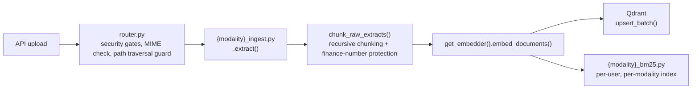

# MAGIK — System Card

**System:** Multimodal Agentic RAG Integrated Knowledge Assistant · **Release:** v1.0.2 (8 September 2026)
**License:** MIT · **Author:** [Vijaya Karthik](https://github.com/vjkarthik98) · **Compiled:** 12 September 2026

Every figure below is read from this repository — the model manifest, `app/eval/thresholds.yaml`, `app/core/config.py`, the Terraform modules, the monitoring configuration, and the test tree — not from summary documentation. Where this card and other repo docs disagreed, the code was treated as authoritative. Open defects, a currently-failing quality gate, and real incidents (including a security one) are included deliberately, not omitted.

MAGIK is a compound AI system, not a single trained model — this card follows the system-card format used for deployed AI products rather than the single-model-checkpoint template, and goes deeper than a typical card into the access-control, observability, and infrastructure layers, since those are as much a part of what was engineered here as the models are.

---

## Contents

1. [Overview](#1-overview)
2. [Architecture](#2-architecture)
3. [Component models](#3-component-models)
4. [Intended use](#4-intended-use)
5. [Training & provenance](#5-training-provenance)
6. [Evaluation](#6-evaluation)
7. [Answer verification](#7-answer-verification)
8. [Guardrails](#8-guardrails)
9. [Authentication & session lifecycle](#9-authentication-session-lifecycle)
10. [Multi-tenant isolation](#10-multi-tenant-isolation)
11. [Observability & monitoring](#11-observability-monitoring)
12. [AWS infrastructure & deployment](#12-aws-infrastructure-deployment)
13. [Reproducibility](#13-reproducibility)
14. [Incident disclosures](#14-incident-disclosures)
15. [Limitations & known issues](#15-limitations-known-issues)
16. [Responsible AI considerations](#16-responsible-ai-considerations)
17. [References](#17-references)

---

## 1. Overview

A finance-domain retrieval-augmented generation system that ingests text, PDF, DOCX, XLSX, images, audio and video; routes each query through an agentic controller; retrieves with a hybrid lexical + dense pipeline; verifies its own answers against retrieved evidence before they reach the user; and runs entirely on self-hosted open-weight models — no third-party LLM API anywhere in the request path.

It specialises in financial documents because finance is an unforgiving domain for RAG: a hallucinated number is worse than a hallucinated sentence. Financial figures in a generated answer are checked against the literal text of the retrieved chunks, and this is gated in CI, not just measured.

| | |
|---|---|
| Modalities ingested | 7 — text, PDF, DOCX, XLSX, image, audio, video, fully isolated pipelines |
| Models composed | 18, ~42GB on disk, all open-weight, 0 fine-tuned |
| Paid LLM APIs | none |
| CI merge gates | 3 enforced — retrieval, hallucination, finance numeric fidelity |
| Test files | 143 across 8 categories |
| AWS accounts to date | 3 (see [Section 12](#12-aws-infrastructure-deployment)) — each migration forced by GPU vCPU quota, not by choice |

## 2. Architecture

### Query flow

```mermaid
flowchart LR
    U["User query"] --> AC["Agent Controller<br/>(timeout + token-budget cap)"]
    AC --> AR["Agent Router<br/>classifies: rag / web / hybrid_web / direct / finance_*"]
    AR --> AE["Agent Executor<br/>(single classify+dispatch)"]
    AE --> TR["Tool Registry"]
    TR --> HR["Hybrid Retriever<br/>BM25 + Qdrant fusion"]
    HR --> RR["CrossEncoder Rerank + MMR"]
    RR --> PB["Prompt Builder<br/>(context + memory fusion)"]
    PB --> LLM["Qwen2.5-14B-Instruct<br/>GGUF via llama.cpp"]
    LLM --> VL["Verification Loop<br/>groundedness + citations, retry on fail"]
    VL --> OG["Output Guard"]
    OG --> SSE["SSE stream to client"]
```

The router classifies each query once and dispatches a single tool call — a bounded dispatch, not an open-ended agent loop. A failed groundedness or citation check retries once through an expanded retrieval strategy, bounded by `AGENT_VERIFY_TIMEOUT_SEC`. Measured retry behaviour: [Section 7](#7-answer-verification).

### Ingestion flow

Audio and video ingestion return a `job_id` immediately and run as a background task. Uploaded originals and the per-user BM25 index land on the instance's local disk (`/opt/magik/data`) — see [Section 14](#14-incident-disclosures) for why that single-copy design already caused one real data-loss incident.

### Per-modality isolation

Every one of the 7 modalities owns exactly 4 files — one per processing layer (ingestion, chunking, embedding, lexical indexing) — with no shared per-modality state. A defect in the spreadsheet pipeline cannot break the audio pipeline. This is also what makes the guardrail coverage claim in [Section 8](#8-guardrails) countable: 7 modalities × 4 layers = 28 text surfaces, each of which must call the single sanitisation entry point.

## 3. Component models

18 open-weight checkpoints, none fine-tuned, each pinned to an exact upstream commit hash rather than a moving branch. The provisioning manifest records a SHA-256 on first download and re-verifies it on every subsequent run.

| Role | Checkpoint | Size |
|---|---|---:|
| Generation (LLM) | Qwen2.5-14B-Instruct · Q4_K_M GGUF | 9.00 GB |
| Vision — charts & images | Qwen/Qwen2-VL-7B-Instruct | 16.59 GB |
| Vision — video frames | Qwen/Qwen2-VL-2B-Instruct | 2.20 GB |
| Evaluation judge | Qwen2.5-7B-Instruct · Q4_K_M GGUF | 4.70 GB |
| Cross-modal embedding | google/siglip-so400m-patch14-384 · 1152-d | 1.76 GB |
| Speech recognition | Systran/faster-whisper-large-v3 | 1.55 GB |
| Text embedding | BAAI/bge-large-en-v1.5 · 1024-d | 1.35 GB |
| Reranking | BAAI/bge-reranker-large · cross-encoder | 1.34 GB |
| Image captioning | Salesforce/blip-image-captioning-large | 0.90 GB |
| Speaker diarization | pyannote/speaker-diarization-3.1 | 0.60 GB |
| Financial sentiment | yiyanghkust/finbert-tone | 0.44 GB |
| Named-entity recognition | dslim/bert-base-NER | 0.43 GB |
| Toxicity screening | Detoxify (original) | 0.42 GB |
| OCR — printed text | microsoft/trocr-large-printed | 0.36 GB |
| Diarization — segmentation | pyannote/segmentation-3.0 | 0.20 GB |
| Diarization — embedding | pyannote/wespeaker-voxceleb-resnet34-LM | 0.10 GB |
| Keyword extraction | all-MiniLM-L6-v2 (KeyBERT) | 0.09 GB |
| OCR — scene text | EasyOCR (en) | 0.06 GB |

The evaluation judge is never loaded during request serving — it runs only when the harness grades a run, and it consolidated three previously separate judging paths onto a single model so scores from different tools are comparable.

## 4. Intended use

**In scope** — question-answering over finance documents a user has uploaded (filings, earnings-call audio/video, spreadsheets, presentations, chart images); demonstrating production-oriented RAG engineering; single-GPU, low-concurrency deployment.

**Out of scope** — not financial advice; not evaluated on non-English documents; not load-tested at commercial multi-tenant scale; the public demo runs a deliberately open shared account, not a place for confidential documents.

## 5. Training & provenance

No model in this system has been fine-tuned. All 18 checkpoints run at their published open weights — no LoRA, no PEFT, no custom training run anywhere in the stack. This is a deliberate scope choice: the engineering investment goes into retrieval quality, answer verification, guardrail coverage, access control, and evaluation rigour around off-the-shelf models.

Where a well-known library is used narrowly, that is said rather than implied: text splitting uses `langchain-core` and `langchain-text-splitters` only — the agent's tool routing (`ToolCall`/`ToolResult`) is a hand-built typed dispatch, not a LangChain agent or chain.

## 6. Evaluation

11 suites are runnable from the harness (`retrieval`, `generation`, `hallucination`, `behavioral`, `ocr`, `audio`, `video`, `routing`, `e2e`, `multimodal`, `regression`). Three are enforced as hard merge gates: **retrieval**, **hallucination**, **finance numeric fidelity**. Everything else is informational, not presented with false parity. Retrieval, routing, guardrail, verification and authentication behaviour are unchanged since v1.0.1 — v1.0.2 was a data-integrity and infrastructure release (see [Section 14](#14-incident-disclosures)), not an eval-affecting one.

> **Measurement methodology.** Three back-to-back runs on identical code once produced faithfulness scores of 0.363, 0.592 and 0.589. The outlier was the first run after a server restart (embedding/KV-cache/judge warmup), not judge stochasticity. Process rule since: discard the first run after any restart, average at least three (`N=3-averaged` below). Where a confirmation run surfaced a genuinely worse value, the gate is set from the **observed maximum**, not the average.

### Retrieval — enforced gate

Baseline v5, measured on the production box against a 56-query gold set. CI floor = 95% of baseline.

| Metric | v5 baseline | CI floor | Latest (staging) | Status |
|---|---:|---:|---:|---|
| recall@5 | 0.5089 | 0.4835 | 0.4464 | 🔴 breach |
| MRR | 0.3558 | 0.3380 | 0.3069 | 🔴 breach |
| nDCG@10 | 0.4024 | 0.3823 | 0.3642 | 🔴 breach |
| recall@10 | 0.5536 | 0.5259 | 0.5625 | 🟢 pass |
| hit rate | 0.6786 | 0.6447 | 0.8036 | 🟢 pass |
| context precision | 0.0268 | 0.0255 | 0.0321 | 🟢 pass |

**Open, left red on purpose — still unattributed as of this release.** 3 of 6 gated metrics are breached while 3 improved — coverage improved while ordering degraded, not a uniform quality drop. Two candidate causes are under attribution: a metadata-backfill step in result fusion that is documented as ranking-neutral but changes a modality score boost (1.5–2.5×), or a baseline/staging provenance mismatch — the baseline was measured on the production box, the breach was measured on the (now-decommissioned) staging box against a snapshot-derived lexical index. The gate stays red until attributed, rather than re-baselined to a number that would encode the cause as "expected." No re-measurement has happened since v1.0.1 because staging itself does not currently exist (see [Section 12](#12-aws-infrastructure-deployment)) — attribution work is blocked on the same GPU quota increase that blocks staging's rebuild.

### Hallucination — enforced gate

Baseline v8, all 7 modalities, n=97, N=3-averaged. Was informational at the previous release; now gate-enforced.

| Metric | v7 | v8 baseline | Gate | Meaning |
|---|---:|---:|---:|---|
| fabrication rate | 0.0653 | 0.0619 | ≤ 0.079 | Primary safety signal — ungrounded numbers, template leakage |
| hallucination rate | 0.2715 | 0.2234 | ≤ 0.246 | Blended metric, kept for continuity |
| omission rate | 0.2302 | 0.1822 | — | Completeness signal, not fabrication — no gate |

The fabrication gate is set at 10% above the *observed maximum* across 4 runs (0.0722), not the 3-run average. A 4th confirmation run surfaced a real, intermittent failure the identical 3 runs had missed: on one audio query the model conflated an unrelated inflation projection elsewhere in the same transcript into a job-vacancy answer — root-caused against the raw transcript and confirmed as a genuine hallucination, not a metric artifact.

### Finance numeric fidelity — enforced gate

Financial figures cited in an answer are matched against the literal text of retrieved chunks within a 0.5% tolerance and **no unit-scale bridging** ("1.2 billion" is not accepted as support for "1,200"). Gated at ≥ 0.95 — at least 95% of cited figures must be traceable to retrieved context.

### Generation and routing — informational

Not gate-enforced; three-run average, default corpus (text/PDF/DOCX, n=42).

| Metric | Value |
|---|---:|
| Answer correctness | 0.7083 |
| Context recall | 0.8962 |
| Finance fidelity | 0.8266 |
| Answer relevancy | 0.6528 |
| Faithfulness | 0.5146 |
| Route accuracy (routing suite, 12/12) | 1.000 |

### Per-modality scorecard — single-run snapshot (2026-08-20)

A live, LLM-judged run (Qwen2.5-7B-Instruct) against the current codebase, one gold set per modality (n=14 rows each, 98 total). This is a **single-run snapshot for a detailed per-metric picture — not the N=3-averaged number the CI gates above enforce** — reported exactly as measured, anomalies included.

**Generation quality**

| Modality | Faithfulness | Answer Relevancy | Answer Correctness | Context Recall |
|---|---:|---:|---:|---:|
| Text | 0.4545 | 0.7045 | 0.6591 | 1.0000 |
| PDF | 0.5714 | 0.7679 | 0.8571 | 0.2846 |
| DOCX | 0.6429 | 0.8077 | 0.7857 | 0.7667 |
| XLSX | 0.6154 | 0.7143 | 0.7321 | 0.7917 |
| Image | 0.8036 | 0.8393 | 0.8929 | 1.0000 |
| Audio | 0.3929 | 0.6429 | 0.6786 | 0.8000 |
| Video | 0.3929 | 0.8214 | 0.7857 | 0.8738 |

**Hallucination & safety**

| Modality | Hallucination Rate | Fabrication Rate | Omission Rate | Template Leak Rate | Citation Accuracy |
|---|---:|---:|---:|---:|---:|
| Text | 0.0909 | 0.0909 | 0.0909 | 0.0000 | 1.0000 |
| PDF | 0.5000 | 0.1429 | 0.3571 | 0.0000 | N/A* |
| DOCX | 0.4286 | 0.0714 | 0.3571 | 0.0000 | 1.0000 |
| XLSX | 0.1429 | 0.0000 | 0.1429 | 0.0000 | 1.0000 |
| Image | 0.0714 | 0.0714 | 0.0000 | 0.0000 | 1.0000 |
| Audio | 0.1429 | 0.0714 | 0.1429 | 0.0000 | 1.0000 |
| Video | 0.2857 | 0.0000 | 0.2857 | 0.0000 | 1.0000 |

*PDF's heuristic citation-accuracy metric had zero measurable rows this run (n=0) — excluded rather than shown as a false 0 or 100.

**Verification loop (grounding / citation / retry)**

| Modality | Grounding Success | Citation Accuracy v2 | Retry Success | Avg Retry Count |
|---|---:|---:|---:|---:|
| Text | 1.0000 | 0.8889 | 0.5000 | 0.2222 |
| PDF | 0.9286 | 0.7857 | 0.3333 | 0.4286 |
| DOCX | 1.0000 | 0.6923 | 0.0000 | 0.1538 |
| XLSX | 0.9167 | 1.0000 | 0.0000 | 0.0833 |
| Image | 0.9286 | 0.9286 | 0.0000 | 0.0714 |
| Audio | 0.7692 | 0.5385 | 0.2727 | 0.9231 |
| Video | 1.0000 | 0.9286 | 0.0000 | 0.3571 |

**Finance fidelity & latency**

| Modality | Finance Fidelity | Verification p50 | Verification p95 | Generation p50 | Generation p95 | Generation p99 |
|---|---:|---:|---:|---:|---:|---:|
| Text | 0.9091 | 4.01s | 11.62s | 11.81s | 34.07s | 44.15s |
| PDF | 0.8433 | 7.13s | 13.95s | 9.70s | 19.36s | 20.52s |
| DOCX | 0.8125 | 3.91s | 9.02s | 6.69s | 10.91s | 11.53s |
| XLSX | 0.9286 | 4.37s | 9.18s | 10.20s | 14.86s | 16.65s |
| Image | 0.9929 | 3.14s | 4.89s | 4.33s | 6.05s | 6.54s |
| Audio | 0.6310 | 9.21s | 15.34s | 12.89s | 19.29s | 22.57s |
| Video | 0.9643 | 3.97s | 6.92s | 8.57s | 11.03s | 11.19s |

**Where it stands:**

- **Image is the strongest modality across the board** — highest correctness (0.89) and faithfulness (0.80), best finance fidelity (0.99), and the fastest generation latency (p95 6.1s).
- **Faithfulness is the weakest quality axis system-wide** (0.39–0.80), not just in audio and video — most modalities have real room to reduce ungrounded claims.
- **Audio needs real improvement** — weakest citation grounding in the verification loop (0.5385), lowest finance fidelity (0.6310), and it retries almost once per query on average (0.9231). A known issue, partially fixed, not fully closed.
- **PDF and DOCX show elevated hallucination rates** (50% and 43% of sampled responses) despite strong correctness scores, alongside PDF's context-recall drop to 0.2846 — an outlier against every other modality. Under investigation, not yet root-caused.
- **Text has unexplained tail-latency spikes** (generation p95 34.07s, p99 44.15s) despite being the structurally simplest modality (no OCR/ASR/vision preprocessing) — flagged for follow-up, not yet root-caused.

**Measurement conditions, kept rather than smoothed over:** partway through this run the app server hit a broken internal process state (repeated I/O errors, unrelated to any modality under test); it was diagnosed to the process level, the GPU and LLM backend were confirmed healthy independently, and the affected process was restarted. Every figure above was captured after that recovery, on a verified-healthy server.

Source: `app/eval/run.py --suite generation --modality <name>`. Full write-ups per modality: [`docs/EVAL_*.md`](.).

## 7. Answer verification

Before an answer reaches the user, a verification loop checks whether its claims are supported by retrieved context and whether its citations point at real chunks, retrying once with an expanded retrieval strategy on failure. At the previous release these metrics existed in the request path but were never scored — they now are.

| Metric | Value |
|---|---:|
| Grounding success rate | 0.9384 |
| Citation accuracy | 0.8587 |
| Verification latency | p50 2.44s · p95 6.81s |
| Mean retries per query | 0.2898 |

**v7 → v8:** grounding success rose 0.8587 → 0.9384; mean retries per query fell 0.50 → 0.29 while retry success rose 0.071 → 0.186 (fewer retries, each more useful); verification latency roughly halved (p50 4.42s → 2.44s, p95 11.07s → 6.81s).

Retry effectiveness, reported honestly: across 140 retried sessions, 88.6% changed nothing, 8.6% raised the score, 1.4% flipped a failing answer to passing. The loop is a safety net that rarely fires usefully, not a general quality multiplier.

**A bug this instrumentation caught.** Building a streaming (SSE) client so the harness could exercise the endpoint the UI actually calls surfaced a defect invisible to every previous run: plain-text documents never triggered the verification loop at all, because ingestion tagged chunks `"text"` while chunking used the canonical `"txt"`. Fixed by aliasing the two tags — repaired gating for all already-indexed chunks without re-ingestion.

## 8. Guardrails

All ingested content — documents, transcripts, web-search results — is treated as untrusted data, never as instructions. A single entry point (`input_guard.sanitize()`) is called on every one of the 28 modality × layer text surfaces before that text reaches a model.

| | |
|---|---|
| Attack recall | 64 / 64 (100%) |
| False-positive rate | 0.9% · F1 = 0.994 |
| Detection patterns | 43, severity-tiered |
| OWASP LLM Top 10 (2025) | 10 / 10 addressed |

Measured against a 109-case red-team corpus (injection, jailbreak, encoding bypass, PII exposure, SSRF, poisoned documents). 306 guardrail test cases cover the same surfaces. Every model response is checked before it reaches the client, and every guardrail violation is written to a persistent audit log — this is also what the `Auth failure spike` and `Guardrail block rate spike` alerts in [Section 11](#11-observability-monitoring) watch in real time.

## 9. Authentication & session lifecycle

Authentication is a full implementation, built request-flow by request-flow, not a demo login. Every default below is the code's actual default in `app/core/config.py` — none are estimates.

### Password login

`POST /auth/login` verifies the submitted password against an Argon2 hash (`time_cost=3`, `memory_cost=65536` KiB — 64 MiB per verification, the OWASP-recommended shape for interactive login), with bcrypt kept as a fallback verifier for any hash created before Argon2 was adopted. On success, a JWT access token and a separate refresh token are issued, both HS256-signed.

| Token | Default lifetime | Config key |
|---|---|---|
| Access token | 30 minutes | `ACCESS_TOKEN_EXPIRE_MINUTES` |
| Refresh token | 7 days | `REFRESH_TOKEN_EXPIRE_DAYS` |

### Multi-factor authentication (TOTP)

Enrollment generates a standard RFC 6238 TOTP secret (`pyotp.random_base32()`), returned to the client as a `provisioning_uri` for any authenticator app, plus **8 single-use backup codes** — each a 10-character hex string, stored only as a bcrypt hash (shown to the user once, in plaintext, at enrollment). Verification allows a ±30 second clock-skew window (`valid_window=1`).

Login with MFA enabled is two-step by design: a correct password issues a short-lived, purpose-scoped **MFA token** (not the real access token) via `begin_login()`; the client then submits a TOTP code or a backup code to `verify_login()`, which only then issues the real JWT pair. A used backup code is logged (`event="mfa_backup_code_used"`) and cannot be reused.

### Google OAuth 2.0

Authorization-code flow with CSRF protection via a server-held `state` parameter — **not PKCE**, a claim corrected on this card and in the README after an earlier draft stated otherwise. The `state` store is a bounded in-memory dictionary (capped at 500 entries, cleared wholesale if the cap is hit) rather than Redis, since state values are short-lived and single-use by construction.

### Password reset (OTP)

A 6-digit numeric OTP is generated, stored in Redis under `otp:{user_id}` with a 10-minute TTL (`OTP_TTL_SECONDS=600`), and emailed. Verification is rate-limited independently of the OTP itself: `OTP_MAX_ATTEMPTS=3` wrong guesses trigger a 15-minute lockout (`OTP_LOCKOUT_SECONDS=900`) tracked in a separate Redis key, and a resend cooldown prevents OTP-spam. A successful verification issues a one-time reset token (`reset:{token}` → user id, 1-hour TTL via `RESET_TOKEN_TTL_SECONDS=3600`) that is consumed on the actual password change.

### Logout & revocation — why it actually revokes

JWTs are stateless by design, which normally means logout is theater — the old token stays valid until it expires on its own. MAGIK closes that gap: on logout or password change, the token's `jti` (JWT ID claim) is written to Redis as `REVOKED_TOKEN:{jti} → "1"`, with a **TTL set to the token's own remaining lifetime** — so the blacklist entry expires at the same moment the token would have anyway, and never grows unbounded. Every request checks this key (with a short-lived in-process cache in front of the Redis round-trip) before trusting a token's claims.

### Rate limiting

Per-user, fixed 60-second window (`u:{user_id}:ratelimit:{window}` in Redis), independent of the OTP-lockout mechanism above — a brute-force attempt against the OTP endpoint and ordinary heavy API usage are rate-limited by two different mechanisms for two different reasons.

## 10. Multi-tenant isolation

Every data layer filters on the user identifier **independently** — there is no layer where isolation is "handled upstream" by another one, and no single missed filter can expose one tenant's data to another. This is a deliberate defense-in-depth choice: a bug in the API layer's authorization check does not, by itself, leak data, because the storage layer underneath enforces its own filter regardless of what called it.

| Data layer | Isolation mechanism | Failure mode if this layer alone were missing |
|---|---|---|
| Qdrant (vectors) | Typed `Filter(must=[FieldCondition(key="user_id", ...)])` on every query | Cross-tenant semantic search results |
| BM25 (lexical) | Per-user index file path on disk — no shared index exists | Cross-tenant keyword search results |
| Redis (memory, cache, rate limits, OTP) | Namespaced keys under `user:{user_id}:*` | Session/conversation bleed between users |
| MongoDB (chat history) | Every query filters on `user_id` explicitly | One user reading another's saved transcript |

The same principle extends to the demo account itself: the public demo is a single shared tenant (`EVAL_USER_ID` in the eval config points at it), not a bypass of tenant isolation — every other real user is isolated from it exactly as they are from each other. What is **not** isolated is durability: the demo tenant's uploaded files live only on the production box's local disk, which is why anyone with demo access can delete the corpus through the Knowledge Base panel (see [Section 14](#14-incident-disclosures)) — a data-durability gap, not a tenant-isolation one.

## 11. Observability & monitoring

Observability is a seven-service stack, not a single `/health` endpoint, defined in `docker-compose.monitoring.yml` and provisioned as code.

| Service | Role |
|---|---|
| Prometheus + Pushgateway | Scrapes `magik_{modality}_{layer}_total` / `_errors_total` counters on a dedicated port, separate from the API port; Pushgateway accepts metrics from short-lived batch jobs that can't be scraped directly |
| OpenTelemetry Collector | Receives distributed trace spans from the full request path |
| Tempo | Stores traces; backs both manual trace lookup and the TraceQL alert below |
| Grafana | Dashboards + unified alerting, reverse-proxied behind Caddy with its own auth |
| Loki + Promtail | Structured JSON log aggregation, correlated to traces via a shared `trace_id` |
| Arize Phoenix | LLM-specific observability (bound to `127.0.0.1` only — never exposed, reachable only from the box itself) |
| Uptime Kuma | External uptime checks via **passive push** from the wake/idle-stop Lambdas — Kuma never polls the app directly, because a poll would itself wake the scale-to-zero GPU box |

### Dashboards

Three Grafana dashboards, provisioned as JSON rather than clicked together by hand: `system_health.json`, `rag_quality.json`, `logs.json`.

### Alerting — 12 rules across 3 groups

Grafana's built-in unified alerting (no separate Alertmanager — judged unnecessary for a single small host), spanning three datasources: Prometheus for most rules, Loki (LogQL) for the log-spike rule, and Tempo (TraceQL) for the trace-error-spike rule.

| Group | Alert | Signal |
|---|---|---|
| `magik-system` | Circuit breaker OPEN | A downstream dependency's circuit breaker has tripped |
| `magik-system` | Ingestion error rate spike | Elevated failures in any modality's ingestion pipeline |
| `magik-system` | p95 latency breach (online sample) | Live request latency exceeding the production ceiling |
| `magik-system` | GPU VRAM critically low | Model memory pressure before an OOM would hit |
| `magik-system` | Reranker p95 latency breach | The cross-encoder rerank step specifically, isolated from end-to-end latency |
| `magik-system` | Application error log rate spike (Loki) | LogQL-based, independent of metrics instrumentation |
| `magik-system` | Span error rate spike (Tempo/TraceQL) | Trace-level error rate — see note below |
| `magik-security` | Guardrail block rate spike | Elevated `input_guard`/`output_guard` blocks — possible attack in progress |
| `magik-security` | Auth failure spike (login + MFA) | Elevated failed logins or failed TOTP/backup-code attempts |
| `magik-rag-quality` | Online hallucination rate drift | Live-traffic signal, distinct from the offline eval gate in [Section 6](#6-evaluation) |
| `magik-rag-quality` | Production traffic drift — WARNING | Anomalous shift in query volume or pattern |
| `magik-rag-quality` | Production traffic drift — CRITICAL | Same signal, higher-severity threshold |

**Disclosed rather than hidden:** the TraceQL-based span-error-rate rule requires Grafana v12.1+ and its own feature toggle (`GF_FEATURE_TOGGLES_ENABLE=tempoAlerting`) — without both, that one rule fails Grafana's provisioning validation at startup. Grafana itself documents TraceQL alerting as experimental and not yet recommended for production. It is included anyway, with that tradeoff accepted explicitly rather than silently, and is flagged in the repo for live verification (forcing a guardrail block and confirming the alert state actually changes) after the first real deploy on the new Grafana version — the same "verify after deploy, don't assume" discipline applied everywhere else in this card.

## 12. AWS infrastructure & deployment

### Three accounts, one recurring cause

| Account | Era | Why it ended |
|---|---|---|
| `537557168406` | Original | Superseded during v1.0.0 bring-up |
| `857194222592` | v1.0.0 – v1.0.1 | GPU vCPU quota of 4 — no room to run production and staging `g6e.xlarge` boxes simultaneously |
| `266901698137` | v1.0.2 – current | Live account |

Every migration has had the identical root cause: a `g6e.xlarge` (1× NVIDIA L40S, 48 GB VRAM) needs 4 GPU vCPUs, and a fresh AWS account's default quota is exactly 4 — enough for one box, never two. The current account's Terraform module is `deploy/aws/terraform-new-account/`; the previous module is kept only as an as-built historical record, marked `DEPRECATED.md`, and is not `apply`-able (its credentials, OIDC provider, and every resource it addressed are gone).

### The AZ capacity fight (2026-09-08 → 2026-09-12)

Once quota was no longer the blocker, capacity was. Production missed `us-east-1a`, then missed `us-east-1b`, and landed in `us-east-1c`. Staging then missed **every** availability zone in the region for three straight days before also landing in `1c`. Both now share a second public subnet (`10.0.3.0/24`) purpose-built for this; only the Uptime Kuma box (`t4g.micro`, no GPU, no capacity pressure) stayed on the original AZ and subnet.

### Network & access

VPC `10.0.0.0/16`, two public subnets. Security groups are asymmetric by design:

| Instance | Inbound | Rationale |
|---|---|---|
| Production | SSH (admin CIDR only), HTTP (ACME challenge + redirect), HTTPS (Caddy: app + `/grafana/`) | Public app, break-glass SSH only from a known network |
| Staging | **Zero inbound rules** | Reachable only via AWS Systems Manager Session Manager — no port to scan, no IP to target |

IAM is split by trust boundary: a GitHub OIDC provider lets GitHub Actions assume a `magik_deploy` role with no long-lived AWS credentials stored in the repo at all; a separate `magik_ec2` role (with AWS's managed `AmazonSSMManagedInstanceCore` policy plus a scoped custom policy for reading its own SSM secrets) is what the running instances themselves use — the CI identity and the runtime identity are never the same principal.

### Staging → gate → promote pipeline

Every tagged release follows a champion→successor pipeline: the production image is built exactly once, deployed to staging, and the full Tier-2 RAG-quality suite (the same suite behind the hallucination gate in [Section 6](#6-evaluation)) runs against it. Only if that gate passes does the identical image — never rebuilt, never re-tagged — get promoted to production. A failing gate rolls staging back to its previous image and alerts; production is skipped entirely rather than rolled back, since nothing was ever deployed there. Staging wakes only for the few minutes a deploy takes and is stopped immediately after.

**Current status, stated plainly: staging does not exist in the new account right now.** Its rebuild is blocked on a second GPU vCPU quota increase, requested the same day production's need became clear. Between 2026-09-08 and 2026-09-12 the pipeline bridged this by keeping staging on the old account's still-intact box (`AWS_STAGING_DEPLOY_ROLE_ARN`) while production ran on the new one — a deliberate, temporary, two-account arrangement, not an oversight. That bridge closed when the old account's box was decommissioned along with the account itself; both deploy roles now resolve to the same account, but staging's box has not been recreated yet. The Terraform module already supports it (`create_staging = true`) — this is a quota wait, not a design gap.

### Production wake / idle-stop

The GPU box is stopped by default and wakes only on an explicit human click at a "Start the demo" interstitial — never on an automated poll, so uptime monitors and crawlers cannot accidentally (or maliciously) run up the compute bill. A scheduled idle-stop function stops the box after 20 minutes of inactivity, gated by a minimum-uptime guard so it can never kill an instance that is mid-deploy, still warming up, or running a live evaluation job.

| | |
|---|---|
| Always-on cost | ~$1,340/month |
| Scale-to-zero cost | ~$12/month fixed + a few $/active hour |
| Cold-start penalty | 60–90s on first request |
| Transport | HTTPS via Caddy; app port never public |

**A bug this separation caught.** Every structured log line carries an `env` field, and staging was once found emitting `"env": "production"` on all of them — a deploy step layered an environment file that never defined `ENV` on top of an AMI clone that already had it set, so production's value silently survived. Left unfixed, staging and production traffic would have been indistinguishable in the shared Grafana/Loki dashboards.

## 13. Reproducibility

Four things are pinned so a box built today builds the same system that was measured:

- **Model weights** — every checkpoint pinned to an exact upstream commit hash, SHA-256 verified on every provisioning run.
- **Python dependencies** — fully locked in a committed lockfile.
- **Infrastructure** — codified in Terraform, not configured by hand — including the AWS account migration in [Section 12](#12-aws-infrastructure-deployment).
- **Vector data** — Qdrant collections can be snapshotted and restored on demand.

This mattered concretely twice: turning on strict manifest checking for the first time revealed the 7B vision model had been required at startup all along but was never downloaded or checksum-verified — silently absent until the pin was enforced; and `app/bin/restore_demo_kb.py` (added in this release) exists precisely because uploaded files and BM25 indexes are *not* yet part of this pinned/reproducible set — see [Section 14](#14-incident-disclosures).

## 14. Incident disclosures

Dated, root-caused, and kept here rather than only in `CHANGELOG.md` — a system card that hides its incidents is worth less than one that explains them.

### 2026-09-08 — Knowledge-base wipe during AWS account migration

**What happened.** Uploaded documents and per-user BM25 indexes live only on an instance's root EBS volume (`/opt/magik/data`), which is blank on a newly built box. Migrating production to the new AWS account replaced the instance and took the demo corpus with it. Qdrant, MongoDB Atlas, and Upstash Redis — all managed, all outside AWS — were unaffected, since they were never part of the migration.

**Fix.** `app/bin/restore_demo_kb.py`: logs in and re-uploads a corpus through the normal `/rag/upload` route rather than copying files onto the box directly. That distinction matters — the real route rebuilds the disk copy, the Qdrant vectors, and the BM25 index together in one pass; hand-copying files would restore only the disk copy and leave retrieval empty. The script skips files already present, so it is safe to re-run.

**Residual risk, stated plainly.** This is a repair tool, not a fix to the underlying architecture. Nothing yet gives uploaded files a second copy, so the same class of loss recurs on the next instance replacement — tracked as a standing item in [Section 15](#15-limitations-known-issues), not closed by this release.

### 2026-09-08 — Chat transcripts lost a turn on every refused answer

**What happened.** Two halves of a chat turn disagreed about whether it had been saved. The streaming handler only persisted a turn when the answer was non-empty and not refused — so a refused answer was simply never written. The frontend, unaware of that, issued a `PATCH .../last-message` regardless, and that patch overwrote "the last assistant message" with no notion of which turn it was actually meant for. Because the current (refused) turn had never been stored, the message it overwrote belonged to the *previous* turn — destroying that answer while the current question never appeared at all.

**Why it was worse than it sounds.** An empty knowledge base (exactly the state caused by the incident above) makes nearly every answer a refusal — so one data-loss incident silently escalated into a second, unrelated one: history corruption on top of missing data.

**Fix.** The patch is now turn-aware: the caller passes the question it believes it is answering, a patch that doesn't match the actual end of the transcript is refused rather than blindly applied, and the correct route now stores the previously-discarded turn instead of dropping it. A 180-second de-duplication window in `save_chat_turn()` also stops the streaming path and the client's own fallback from writing the same question twice. Covered by `tests/unit/memory/test_chat_transcript_integrity.py`.

### 2026-09-12 — Private SSH key committed to a public repository

**What happened.** Four Terraform plan files — `destroy.tfplan`, `destroy2.tfplan`, `kuma.tfplan`, `kuma_t4g.tfplan` — were tracked in this public repository. A `.tfplan` is a zip archive whose `tfplan` and `tfstate` members are **not** redacted the way `terraform plan`'s console output is, so each one embedded the full PEM of `tls_private_key.magik`: the RSA-4096 break-glass SSH key for the (at-the-time-live) AWS account `857194222592`.

**Why two independent controls both missed it.** The directory's `.gitignore` listed plan files as `tfplan*`, a pattern that matches `tfplan3.out` but not `destroy.tfplan` — one wrong glob. CI's `detect-secrets` gate scans every tracked file, so these were technically in scope, but the tool skips binary content, and a `.tfplan` is a zip — a blind spot in the tool's design, not a misconfiguration of it. The `.gitignore` pattern was therefore the only control actually capable of catching this, and it had the one gap that let it through.

**Impact, assessed rather than assumed.**
- What leaked: one RSA private key, for an AWS account that no longer exists. Every instance it could have opened has been deleted.
- What did **not** leak: no SSM parameter *values*. The embedded Terraform state contains no `aws_ssm_parameter` resources at all — secrets appear only as IAM policy ARNs, never as values.
- The current account is unaffected: `terraform-new-account/` generates its own independent key pair; its public key was compared directly against the leaked one and the fingerprints differ.

**Fix and a deliberate non-fix.** Both glob spellings (`tfplan*` and the exact filenames) are now excluded, in both the deprecated module and the current one. The four files are untracked as of this release — removed from the tip, but **not** scrubbed from git history, since a public repo's history is fetchable regardless of a later commit. History was left intact rather than force-rewritten, because the key opens nothing that still exists; force-rewriting a public repo's history to protect an already-dead credential was judged to trade a real disruption (every existing clone and fork diverging) for no real security gain. If this module is ever revived against a live account, the stated plan is to generate a fresh key pair first and treat the old one as permanently burned regardless.

## 15. Limitations & known issues

Documented deliberately rather than left implicit — a system that lists only its strengths is less credible, not more.

- **Three retrieval gate metrics are breached and unattributed** — see [Section 6](#6-evaluation). Left red on purpose rather than re-baselined, and attribution work is itself blocked on staging's rebuild.
- **Staging does not currently exist in the production AWS account** — see [Section 12](#12-aws-infrastructure-deployment). Blocked on a GPU vCPU quota increase; the Terraform module already supports recreating it the moment quota lands.
- **Uploaded files and BM25 indexes have no second copy** — the architectural gap behind the 2026-09-08 knowledge-base wipe ([Section 14](#14-incident-disclosures)) is repaired by a restore script, not closed. The same loss recurs on the next instance replacement.
- **Retrieval context precision is low in absolute terms** (0.027 at baseline). Gated against further drift, but needs a dedicated retrieval-quality pass not yet scheduled.
- **A real, intermittent hallucination remains open** — dense audio transcripts occasionally cause the model to conflate two unrelated numeric figures from the same document. Root-caused, low-frequency, reflected in the gate, not yet fixed.
- **The hybrid web route does not execute a live web search** — a known open defect, thresholded at zero so it cannot silently pass.
- **The default generation suite covers only text, PDF and DOCX** — image and spreadsheet rows must be requested explicitly.
- **Streaming evaluation is manual, not continuous** — the harness can exercise the endpoint the UI uses, but not yet on every CI run.
- **A modality-tagging audit is incomplete** — the fix in [Section 7](#7-answer-verification) was found by inspection; PDF/DOCX/XLSX ingestion paths construct tags the same way and have not been fully audited.
- **PDF's context recall (0.2846) and PDF/DOCX's hallucination rates (50% and 43%) are unexplained outliers** in the 2026-08-20 per-modality scorecard ([Section 6](#6-evaluation)) — flagged for follow-up, not yet root-caused.
- **Audio is the weakest modality on citation accuracy (0.5385) and retry cost** (0.92 retries/query on average, same scorecard) — a known issue, partially fixed, not fully closed.
- **Text shows unexplained tail-latency spikes** (generation p95 34.07s, p99 44.15s, same scorecard) despite being the structurally simplest modality — flagged for follow-up, not yet investigated.
- **Finance numeric fidelity is enforced at merge time, not sampled from live traffic.**
- **No formal fairness or bias audit has been conducted** — the system reasons over documents, not people, but that is a scope argument, not an evaluation.
- **Single production instance, no horizontal scaling or failover** — the second GPU instance is a pre-deploy quality gate when it exists, not a hot standby, and it currently does not exist at all (see above).
- **The TraceQL-based alert rule runs on functionality Grafana itself calls experimental** — see [Section 11](#11-observability-monitoring). Included with that tradeoff stated, pending live verification on the current Grafana version.

## 16. Responsible AI considerations

- **No external inference provider** — every model is self-hosted, so document and query content never leaves the deployment boundary for a third-party LLM API.
- **PII detection** integrated across ingestion and memory surfaces via Microsoft Presidio.
- **Toxicity screening** on model output via Detoxify.
- **Untrusted-content discipline** — ingested documents, transcripts and web results are always handled as data, never as instructions.
- **Auditability** — every guardrail violation is written to a persistent audit log, and authentication/MFA failures are monitored in real time ([Section 11](#11-observability-monitoring)).
- **Answer traceability** — answers carry citations to retrieved chunks; the finance-fidelity check exists so a cited number can be traced back to source text.
- **Incident transparency** — real operational and security incidents are disclosed with root cause and impact assessment ([Section 14](#14-incident-disclosures)) rather than only reported as fixed.

## 17. References

| | |
|---|---|
| Repository | [github.com/vjkarthik98/MULTIMODAL-AGENTIC-RAG-INTEGRATED-KNOWLEDGE-AI-ASSISTANT](https://github.com/vjkarthik98/MULTIMODAL-AGENTIC-RAG-INTEGRATED-KNOWLEDGE-AI-ASSISTANT) |
| Release | v1.0.2 · 8 September 2026 |
| License | MIT |
| Author | Vijaya Karthik |
| Engineering log | Full change history in [`CHANGELOG.md`](../CHANGELOG.md), including root-caused production incidents |
| Per-modality eval detail | [`docs/EVAL_*.md`](.) |
| Deprecated AWS module (as-built record only) | [`deploy/aws/terraform/DEPRECATED.md`](../deploy/aws/terraform/DEPRECATED.md) |
