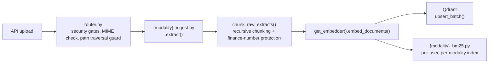

# MAGIK — System Card

**System:** Multimodal Agentic RAG Integrated Knowledge Assistant · **Release:** v1.0.1 (30 August 2026)
**License:** MIT · **Author:** [Vijaya Karthik](https://github.com/vjkarthik98) · **Live demo:** [magik.vk-ai.online](https://magik.vk-ai.online)

Every figure below is read from this repository — the model manifest, `app/eval/thresholds.yaml`, the deployment config, and the test tree — not from summary documentation. Where this card and other repo docs disagreed, the code was treated as authoritative. Open defects and a currently-failing quality gate are included deliberately, not omitted.

MAGIK is a compound AI system, not a single trained model — this card follows the system-card format used for deployed AI products rather than the single-model-checkpoint template.

---

## 1. Overview

A finance-domain retrieval-augmented generation system that ingests text, PDF, DOCX, XLSX, images, audio and video; routes each query through an agentic controller; retrieves with a hybrid lexical + dense pipeline; verifies its own answers against retrieved evidence before they reach the user; and runs entirely on self-hosted open-weight models — no third-party LLM API anywhere in the request path.

It specialises in financial documents because finance is an unforgiving domain for RAG: a hallucinated number is worse than a hallucinated sentence. Financial figures in a generated answer are checked against the literal text of the retrieved chunks, and this is gated in CI, not just measured.

| | |
|---|---|
| Modalities ingested | 7 — text, PDF, DOCX, XLSX, image, audio, video, fully isolated pipelines |
| Models composed | 18, ~42GB on disk, all open-weight, 0 fine-tuned |
| Paid LLM APIs | none |
| CI merge gates | 3 enforced — retrieval, hallucination, finance numeric fidelity |
| Test files | 142 across 8 categories |

## 2. Architecture

### Query flow

```mermaid
flowchart LR
    U["User query"] --> AC["Agent Controller<br/>(timeout + token-budget cap)"]
    AC --> AR["Agent Router<br/>classifies: rag / web / hybrid_web / direct / finance_*"]
    AR --> AE["Agent Executor<br/>(single classify+dispatch)"]
    AE --> TR["Tool Registry"]
    TR --> HR["Hybrid Retriever<br/>BM25 + Qdrant fusion"]
    HR --> RR["CrossEncoder Rerank + MMR"]
    RR --> PB["Prompt Builder<br/>(context + memory fusion)"]
    PB --> LLM["Qwen2.5-14B-Instruct<br/>GGUF via llama.cpp"]
    LLM --> VL["Verification Loop<br/>groundedness + citations, retry on fail"]
    VL --> OG["Output Guard"]
    OG --> SSE["SSE stream to client"]
```

The router classifies each query once and dispatches a single tool call — a bounded dispatch, not an open-ended agent loop. A failed groundedness or citation check retries once through an expanded retrieval strategy, bounded by `AGENT_VERIFY_TIMEOUT_SEC`. Measured retry behaviour: [Section 7](#7-answer-verification).

### Ingestion flow

Audio and video ingestion return a `job_id` immediately and run as a background task.

### Per-modality isolation

Every one of the 7 modalities owns exactly 4 files — one per processing layer (ingestion, chunking, embedding, lexical indexing) — with no shared per-modality state. A defect in the spreadsheet pipeline cannot break the audio pipeline. This is also what makes the guardrail coverage claim in [Section 8](#8-guardrails) countable: 7 modalities × 4 layers = 28 text surfaces, each of which must call the single sanitisation entry point.

## 3. Component models

18 open-weight checkpoints, none fine-tuned, each pinned to an exact upstream commit hash rather than a moving branch. The provisioning manifest records a SHA-256 on first download and re-verifies it on every subsequent run.

| Role | Checkpoint | Size |
|---|---|---:|
| Generation (LLM) | Qwen2.5-14B-Instruct · Q4_K_M GGUF | 9.00 GB |
| Vision — charts & images | Qwen/Qwen2-VL-7B-Instruct | 16.59 GB |
| Vision — video frames | Qwen/Qwen2-VL-2B-Instruct | 2.20 GB |
| Evaluation judge | Qwen2.5-7B-Instruct · Q4_K_M GGUF | 4.70 GB |
| Cross-modal embedding | google/siglip-so400m-patch14-384 · 1152-d | 1.76 GB |
| Speech recognition | Systran/faster-whisper-large-v3 | 1.55 GB |
| Text embedding | BAAI/bge-large-en-v1.5 · 1024-d | 1.35 GB |
| Reranking | BAAI/bge-reranker-large · cross-encoder | 1.34 GB |
| Image captioning | Salesforce/blip-image-captioning-large | 0.90 GB |
| Speaker diarization | pyannote/speaker-diarization-3.1 | 0.60 GB |
| Financial sentiment | yiyanghkust/finbert-tone | 0.44 GB |
| Named-entity recognition | dslim/bert-base-NER | 0.43 GB |
| Toxicity screening | Detoxify (original) | 0.42 GB |
| OCR — printed text | microsoft/trocr-large-printed | 0.36 GB |
| Diarization — segmentation | pyannote/segmentation-3.0 | 0.20 GB |
| Diarization — embedding | pyannote/wespeaker-voxceleb-resnet34-LM | 0.10 GB |
| Keyword extraction | all-MiniLM-L6-v2 (KeyBERT) | 0.09 GB |
| OCR — scene text | EasyOCR (en) | 0.06 GB |

The evaluation judge is never loaded during request serving — it runs only when the harness grades a run, and it consolidated three previously separate judging paths onto a single model so scores from different tools are comparable.

## 4. Intended use

**In scope** — question-answering over finance documents a user has uploaded (filings, earnings-call audio/video, spreadsheets, presentations, chart images); demonstrating production-oriented RAG engineering; single-GPU, low-concurrency deployment.

**Out of scope** — not financial advice; not evaluated on non-English documents; not load-tested at commercial multi-tenant scale; the public demo runs a deliberately open shared account, not a place for confidential documents.

## 5. Training & provenance

No model in this system has been fine-tuned. All 18 checkpoints run at their published open weights — no LoRA, no PEFT, no custom training run anywhere in the stack. This is a deliberate scope choice: the engineering investment goes into retrieval quality, answer verification, guardrail coverage and evaluation rigour around off-the-shelf models.

Where a well-known library is used narrowly, that is said rather than implied: text splitting uses `langchain-core` and `langchain-text-splitters` only — the agent's tool routing (`ToolCall`/`ToolResult`) is a hand-built typed dispatch, not a LangChain agent or chain.

## 6. Evaluation

11 suites are runnable from the harness (`retrieval`, `generation`, `hallucination`, `behavioral`, `ocr`, `audio`, `video`, `routing`, `e2e`, `multimodal`, `regression`). Three are enforced as hard merge gates: **retrieval**, **hallucination**, **finance numeric fidelity**. Everything else is informational, not presented with false parity.

> **Measurement methodology.** Three back-to-back runs on identical code once produced faithfulness scores of 0.363, 0.592 and 0.589. The outlier was the first run after a server restart (embedding/KV-cache/judge warmup), not judge stochasticity. Process rule since: discard the first run after any restart, average at least three (`N=3-averaged` below). Where a confirmation run surfaced a genuinely worse value, the gate is set from the **observed maximum**, not the average.

### Retrieval — enforced gate

Baseline v5, measured on the production box against a 56-query gold set. CI floor = 95% of baseline.

| Metric | v5 baseline | CI floor | Latest (staging) | Status |
|---|---:|---:|---:|---|
| recall@5 | 0.5089 | 0.4835 | 0.4464 | 🔴 breach |
| MRR | 0.3558 | 0.3380 | 0.3069 | 🔴 breach |
| nDCG@10 | 0.4024 | 0.3823 | 0.3642 | 🔴 breach |
| recall@10 | 0.5536 | 0.5259 | 0.5625 | 🟢 pass |
| hit rate | 0.6786 | 0.6447 | 0.8036 | 🟢 pass |
| context precision | 0.0268 | 0.0255 | 0.0321 | 🟢 pass |

**Open, left red on purpose.** 3 of 6 gated metrics are breached while 3 improved — coverage improved while ordering degraded, not a uniform quality drop. Two candidate causes are under attribution: a metadata-backfill step in result fusion that is documented as ranking-neutral but changes a modality score boost (1.5–2.5×), or a baseline/staging provenance mismatch — the baseline was measured on the production box, the breach was measured on the private staging box (see [Section 12](#12-deployment)) against a snapshot-derived lexical index. The gate stays red until attributed, rather than re-baselined to a number that would encode the cause as "expected."

### Hallucination — enforced gate

Baseline v8, all 7 modalities, n=97, N=3-averaged. Was informational at the previous release; now gate-enforced.

| Metric | v7 | v8 baseline | Gate | Meaning |
|---|---:|---:|---:|---|
| fabrication rate | 0.0653 | 0.0619 | ≤ 0.079 | Primary safety signal — ungrounded numbers, template leakage |
| hallucination rate | 0.2715 | 0.2234 | ≤ 0.246 | Blended metric, kept for continuity |
| omission rate | 0.2302 | 0.1822 | — | Completeness signal, not fabrication — no gate |

The fabrication gate is set at 10% above the *observed maximum* across 4 runs (0.0722), not the 3-run average. A 4th confirmation run surfaced a real, intermittent failure the identical 3 runs had missed: on one audio query the model conflated an unrelated inflation projection elsewhere in the same transcript into a job-vacancy answer — root-caused against the raw transcript and confirmed as a genuine hallucination, not a metric artifact.

### Finance numeric fidelity — enforced gate

Financial figures cited in an answer are matched against the literal text of retrieved chunks within a 0.5% tolerance and **no unit-scale bridging** ("1.2 billion" is not accepted as support for "1,200"). Gated at ≥ 0.95 — at least 95% of cited figures must be traceable to retrieved context.

### Generation and routing — informational

Not gate-enforced; three-run average, default corpus (text/PDF/DOCX, n=42).

| Metric | Value |
|---|---:|
| Answer correctness | 0.7083 |
| Context recall | 0.8962 |
| Finance fidelity | 0.8266 |
| Answer relevancy | 0.6528 |
| Faithfulness | 0.5146 |
| Route accuracy (routing suite, 12/12) | 1.000 |

## 7. Answer verification

Before an answer reaches the user, a verification loop checks whether its claims are supported by retrieved context and whether its citations point at real chunks, retrying once with an expanded retrieval strategy on failure. At the previous release these metrics existed in the request path but were never scored — they now are.

| Metric | Value |
|---|---:|
| Grounding success rate | 0.9384 |
| Citation accuracy | 0.8587 |
| Verification latency | p50 2.44s · p95 6.81s |
| Mean retries per query | 0.2898 |

**v7 → v8:** grounding success rose 0.8587 → 0.9384; mean retries per query fell 0.50 → 0.29 while retry success rose 0.071 → 0.186 (fewer retries, each more useful); verification latency roughly halved (p50 4.42s → 2.44s, p95 11.07s → 6.81s).

Retry effectiveness, reported honestly: across 140 retried sessions, 88.6% changed nothing, 8.6% raised the score, 1.4% flipped a failing answer to passing. The loop is a safety net that rarely fires usefully, not a general quality multiplier.

**A bug this instrumentation caught.** Building a streaming (SSE) client so the harness could exercise the endpoint the UI actually calls surfaced a defect invisible to every previous run: plain-text documents never triggered the verification loop at all, because ingestion tagged chunks `"text"` while chunking used the canonical `"txt"`. Fixed by aliasing the two tags — repaired gating for all already-indexed chunks without re-ingestion.

## 8. Guardrails

All ingested content — documents, transcripts, web-search results — is treated as untrusted data, never as instructions. A single entry point (`input_guard.sanitize()`) is called on every one of the 28 modality × layer text surfaces before that text reaches a model.

| | |
|---|---|
| Attack recall | 64 / 64 (100%) |
| False-positive rate | 0.9% · F1 = 0.994 |
| Detection patterns | 43, severity-tiered |
| OWASP LLM Top 10 (2025) | 10 / 10 addressed |

Measured against a 109-case red-team corpus (injection, jailbreak, encoding bypass, PII exposure, SSRF, poisoned documents). 306 guardrail test cases cover the same surfaces. Every model response is checked before it reaches the client, and every guardrail violation is written to a persistent audit log.

## 9. Security & access control

JWT access/refresh tokens (HS256), Argon2 password hashing with a bcrypt fallback, Google OAuth 2.0 authorization-code sign-in with CSRF state validation, TOTP multi-factor authentication, a Redis-backed token blacklist so logout/revocation actually take effect, and per-user rate limiting on a 60-second window. Production secrets live in AWS Parameter Store as encrypted values, fetched fresh at deploy time, written to a mode-0600 file, never committed.

**Tenant isolation** — every data layer filters on the user identifier independently:

| Data layer | Isolation mechanism |
|---|---|
| Qdrant (vectors) | Typed field condition on `user_id` in every query filter |
| BM25 (lexical) | Per-user index file path — no shared index exists |
| Redis (memory, cache) | Namespaced keys under `user:{user_id}:*` |
| MongoDB (history) | Every query filters on `user_id` explicitly |

## 10. Reproducibility

Four things are pinned so a box built today builds the same system that was measured:

- **Model weights** — every checkpoint pinned to an exact upstream commit hash, SHA-256 verified on every provisioning run.
- **Python dependencies** — fully locked in a committed lockfile.
- **Infrastructure** — codified in Terraform, not configured by hand.
- **Vector data** — Qdrant collections can be snapshotted and restored on demand.

This mattered concretely: turning on strict manifest checking for the first time revealed the 7B vision model had been required at startup all along but was never downloaded or checksum-verified — silently absent until the pin was enforced.

## 11. Limitations & known issues

Documented deliberately rather than left implicit — a system that lists only its strengths is less credible, not more.

- **Three retrieval gate metrics are breached and unattributed** — see [Section 6](#6-evaluation). Left red on purpose rather than re-baselined.
- **Retrieval context precision is low in absolute terms** (0.027 at baseline). Gated against further drift, but needs a dedicated retrieval-quality pass not yet scheduled.
- **A real, intermittent hallucination remains open** — dense audio transcripts occasionally cause the model to conflate two unrelated numeric figures from the same document. Root-caused, low-frequency, reflected in the gate, not yet fixed.
- **The hybrid web route does not execute a live web search** — a known open defect, thresholded at zero so it cannot silently pass.
- **The default generation suite covers only text, PDF and DOCX** — image and spreadsheet rows must be requested explicitly.
- **Streaming evaluation is manual, not continuous** — the harness can exercise the endpoint the UI uses, but not yet on every CI run.
- **A modality-tagging audit is incomplete** — the fix in Section 7 was found by inspection; PDF/DOCX/XLSX ingestion paths construct tags the same way and have not been fully audited.
- **Finance numeric fidelity is enforced at merge time, not sampled from live traffic.**
- **No formal fairness or bias audit has been conducted** — the system reasons over documents, not people, but that is a scope argument, not an evaluation.
- **Single production instance, no horizontal scaling or failover** — the second GPU instance ([Section 12](#12-deployment)) is a pre-deploy quality gate, not a hot standby.

## 12. Deployment

Production runs on a single AWS GPU instance — NVIDIA L40S, 48GB VRAM — behind a wake gateway and a scheduled idle-stop function (20 min idle, minimum-uptime guard). As of this release, the gateway starts the GPU only on an explicit human click, never on an automated poll.

| | |
|---|---|
| Always-on cost | ~$1,340/month |
| Scale-to-zero cost | ~$12/month fixed + a few $/active hour |
| Cold-start penalty | 60–90s on first request |
| Transport | HTTPS via Caddy; app port never public |

### Production vs. staging

Two identically-provisioned GPU instances exist, not one — a public production box and a **private staging box used solely as a pre-deploy quality gate**. Staging carries no Elastic IP, no public port, no Caddy reverse proxy and no monitoring stack; the only way onto it is AWS Systems Manager, and it never serves user traffic.

| | |
|---|---|
| Instances | 2 × g6e.xlarge (L40S), identical hardware |
| Staging access | SSM only — no public port, no Elastic IP |
| Promotion gate | Full Tier-2 quality suite must pass |
| Staging uptime | Minutes per deploy, not continuous |

Every tagged release follows a champion→successor pipeline: the production image is built exactly once, deployed to staging, and the full Tier-2 RAG-quality suite (the same suite behind the hallucination gate in [Section 6](#6-evaluation)) runs against it. Only if that gate passes does the identical image — never rebuilt, never re-tagged — get promoted to production. A failing gate rolls staging back to its previous image and alerts; production is skipped entirely rather than rolled back, since nothing was ever deployed there. Staging wakes only for the few minutes a deploy takes and is stopped immediately after, so it does not double the always-on cost above. Both boxes share the same external Qdrant/Redis/MongoDB services, isolated by tenant scoping rather than fully separate infrastructure — a documented tradeoff, not an oversight.

**A bug this separation caught.** Every structured log line carries an `env` field, and staging was found emitting `"env": "production"` on all of them — a deploy step layered an environment file that never defined `ENV` on top of an AMI clone that already had it set, so production's value silently survived. Left unfixed, staging and production traffic would have been indistinguishable in the shared Grafana/Loki dashboards.

Observability on production is a full stack: structured JSON logs in Loki under a shared trace ID, Prometheus counters per modality/layer, OpenTelemetry spans in Tempo, Grafana dashboards behind reverse-proxy auth, and alerting on circuit-breaker trips, ingestion error spikes, latency breaches and hallucination-rate drift.

## 13. Responsible AI considerations

- **No external inference provider** — every model is self-hosted, so document and query content never leaves the deployment boundary for a third-party LLM API.
- **PII detection** integrated across ingestion and memory surfaces via Microsoft Presidio.
- **Toxicity screening** on model output via Detoxify.
- **Untrusted-content discipline** — ingested documents, transcripts and web results are always handled as data, never as instructions.
- **Auditability** — every guardrail violation is written to a persistent audit log.
- **Answer traceability** — answers carry citations to retrieved chunks; the finance-fidelity check exists so a cited number can be traced back to source text.

## 14. References

| | |
|---|---|
| Live demo | [magik.vk-ai.online](https://magik.vk-ai.online) — GPU box wakes on click; first response 60–90s |
| Repository | [github.com/vjkarthik98/MULTIMODAL-AGENTIC-RAG-INTEGRATED-KNOWLEDGE-AI-ASSISTANT](https://github.com/vjkarthik98/MULTIMODAL-AGENTIC-RAG-INTEGRATED-KNOWLEDGE-AI-ASSISTANT) |
| Release | v1.0.1 · 30 August 2026 |
| License | MIT |
| Author | Vijaya Karthik |
| Engineering log | Full change history in [`CHANGELOG.md`](../CHANGELOG.md), including root-caused production incidents |
| Per-modality eval detail | [`docs/EVAL_*.md`](.) |
