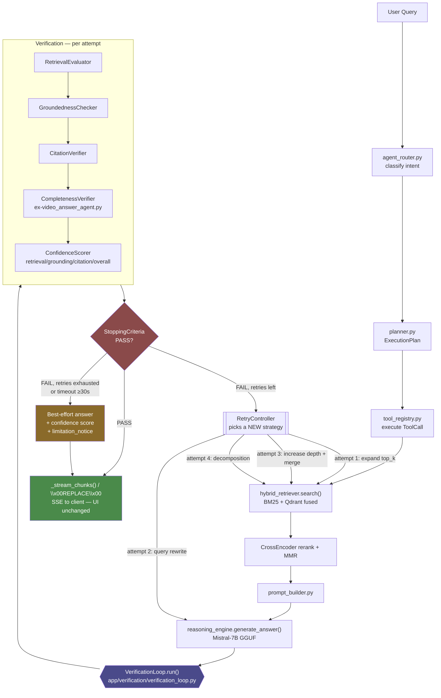

# Phase 32 — Agentic Answer Verification & Self-Correcting Retrieval Loop

MAGIK-adapted from the generic "self-verifying RAG agent" spec. This version is
grounded in the code that actually exists today — it names real files, real
functions, real call sites — so it can be handed to a builder skill and
implemented without re-deriving architecture first.

**Priority: accuracy over latency.** Every answer must pass verification
before it reaches the client. Latency regressions are acceptable; unverified
answers are not.

---

## 0. What already exists (reuse, don't rebuild)

The current codebase is not starting from zero on verification. Before adding
new modules, the plan reuses:

| Capability | Already lives at | Keep as |
|---|---|---|
| Numeric-citation hallucination guard, one-shot hardened retry | `app/reasoning/reasoning_engine.py` — `_unsupported_numbers`, `_hallucination_guard`, `_verify_numeric_citations`, the retry block in `ReasoningEngine.generate_answer` (~L1975-2011) | Inner "Attempt-0" guard. `GroundednessChecker` wraps and reports on this, doesn't replace it. |
| Tunable retrieval depth | `app/retrieval/hybrid_retriever.py` — `HybridRetriever.search(query, session_id, top_k, filters, user_id)`, `candidate_multiplier` | Lever for RetryController's "increase candidate pool" strategy. |
| Query decomposition | `app/pipeline/rag_pipeline.py::_split_query_aspects()` (~L1593) — currently only wired into the video-only block | Promote to the generic Decomposition retry strategy for **all** modalities, not just video. |
| Multi-aspect context assembly | `app/pipeline/rag_pipeline.py::_build_av_stream_context()` | Reused by RetrievalEvaluator's "insufficient coverage" recovery path. |
| Degenerate/refusal detection | `app/pipeline/rag_pipeline.py::_is_llm_refusal()`, `_is_degenerate_answer()` | Reused as a fast FAIL short-circuit before running the full verifier. |
| Doc/citation dedup | `app/pipeline/rag_pipeline.py::_dedup_docs()`, `_normalize_docs()` | Reused when RetryController merges evidence across attempts. |
| Filter hints threaded from routing | `app/agents/agent_schema.py::AgentDecision` (`modality_hint`, `call_section_filter`, `source_type_filter`) | Reused unchanged for metadata-aware retry re-issue. |
| Citation metadata (page/worksheet/timestamp/frame) | `app/core/response.py::build_sources()` → `cite_key`, `page_number`, `start_time`, `frame`, `worksheet` fields already on every source dict | Primary input to `CitationVerifier` — no schema change needed. |
| Hold-then-stream delivery | `app/api/api_routes.py::stream_query` — the `\x00REPLACE\x00` sentinel (canonical guarded answer supersedes streamed tokens) and the buffer-then-`_stream_chunks()` pattern already used for the cached and web-search paths | Becomes the delivery mechanism for verified answers on **every** modality — no UI or SSE contract change. |
| Bounded-loop precedent | `app/agents/agent_controller.py` — enforces max-steps-equivalent + wall-clock timeout + token budget simultaneously (CLAUDE.md hard rule) | `VerificationLoop` must independently enforce the same triple bound, because it runs deeper in the pipeline (inside `rag_pipeline.stream()` / `query_pipeline.process()`), past the point `AgentController`'s timeout wraps. |

### `app/agents/video_answer_agent.py` is retired, not upgraded

Its two functions, `verify_aspect_coverage()` and `assemble_answer()`, are a
video-only special case of exactly one of the six verification
responsibilities below: **Completeness Verification**. They get folded into
`app/verification/completeness_verifier.py` as a modality-agnostic checker
(same keyword-overlap heuristic, generalized to any multi-part question —
PDF/XLSX "compare X and Y and Z" questions have the same dropped-aspect
failure mode video does). The file is deleted; the video-only import block in
`app/pipeline/rag_pipeline.py` (~L3148-3200) is replaced by a single call into
`VerificationLoop`, which every modality now goes through.

---

## 1. Goal

Generation stops being the last step. It becomes an intermediate step. An
answer is only streamed after it passes verification:

```
Query → Rewrite (retry-only) → Embed → Hybrid Retrieve → Rerank
   → Prompt Build → LLM Generate → AGENT VERIFICATION → Decision
   → PASS → buffer-flush via existing _stream_chunks()/REPLACE path
   → FAIL → Retry (bounded) → repeat → best-effort answer + confidence notice
```

### Architecture diagram



Both `AGENT VERIFICATION` and everything under it is new. Everything above the
`GEN` node (router → planner → retrieval → rerank → prompt → generate) is
existing MAGIK architecture, untouched.

---

## 2. New package: `app/verification/`

Parallel to `app/agents/` and `app/reasoning/`. Nine modules, matching the
nine named components in the original spec:

```
app/verification/
├── __init__.py              # public dispatch: verify(query, docs, answer, sources, modality) -> VerificationReport
├── verification_schema.py   # Pydantic: VerificationReport, ConfidenceScores, RetryAttempt (same style as agent_schema.py)
├── retrieval_evaluator.py   # RetrievalEvaluator — is the evidence even relevant?
├── groundedness_checker.py  # GroundednessChecker — wraps reasoning_engine's guard, adds per-sentence support scoring
├── citation_verifier.py     # CitationVerifier — cited page/worksheet/timestamp/frame actually contains the claim
├── completeness_verifier.py # CompletenessVerifier — video_answer_agent.py logic, generalized
├── confidence_scorer.py     # ConfidenceScorer — combines the above into 4 scores (0-100)
├── retry_controller.py      # RetryController — picks a DIFFERENT strategy per attempt, bounded
├── stopping_criteria.py     # StoppingCriteria — the 5 termination conditions
└── verification_loop.py     # VerificationLoop — orchestrates generate→verify→decide→retry
```

### `verification_schema.py`

```python
class ConfidenceScores(BaseModel):
    retrieval:  float  # 0-100
    grounding:  float
    citation:   float
    overall:    float

class RetryAttempt(BaseModel):
    attempt_number: int
    strategy: Literal["baseline","expand_retrieval","query_rewrite",
                       "increase_depth","decomposition"]
    scores: ConfidenceScores
    decision: Literal["PASS","FAIL"]
    reason: str
    duration_ms: float

class VerificationReport(BaseModel):
    verified: bool
    scores: ConfidenceScores
    unsupported_claims: List[str]
    bad_citations: List[str]
    missing_aspects: List[str]
    attempts: List[RetryAttempt]
    total_duration_ms: float
    degraded: bool          # True if returned as best-effort after exhausting retries
    limitation_notice: Optional[str]  # user-facing text when degraded
```

### Responsibility → module → concrete signal mapping

1. **Retrieval Quality** (`retrieval_evaluator.py`) — reranker/fusion scores
   already computed in `hybrid_retriever.search()`, doc-count vs. query-aspect
   count from `_split_query_aspects()`, conflicting-evidence check via
   contradictory numeric values across top-k docs.
2. **Groundedness** (`groundedness_checker.py`) — calls
   `reasoning_engine._hallucination_guard()` and `_unsupported_numbers()`
   directly (no duplication), adds sentence-level support-fraction scoring for
   non-numeric claims.
3. **Citation Verification** (`citation_verifier.py`) — for each `cite_key` in
   the answer, confirms the source dict's `page_number` / `worksheet` /
   `start_time` / `frame` field is present on a doc whose text actually
   contains the cited span (substring/fuzzy match against the chunk text, not
   just "a source with this key exists").
4. **Source Verification** — folded into (3); rejecting wrong
   page/timestamp/frame/worksheet is the same check as citation verification
   against chunk content.
5. **Completeness** (`completeness_verifier.py`) — generalized
   `verify_aspect_coverage()` from the retired `video_answer_agent.py`.
6. **Confidence Estimation** (`confidence_scorer.py`) — combines 1-5 into the
   four 0-100 scores.

---

## 3. PASS / FAIL thresholds (configurable, not hardcoded)

Per CLAUDE.md ("no literals inlined — all via `settings.*`"), add to
`app/core/config.py`:

```python
AGENT_VERIFY_RETRIEVAL_MIN: float = 90.0
AGENT_VERIFY_GROUNDING_MIN: float = 90.0
AGENT_VERIFY_CITATION_MIN:  float = 95.0
AGENT_VERIFY_OVERALL_MIN:   float = 90.0
AGENT_VERIFY_MAX_RETRIES:   int   = 3
AGENT_VERIFY_TIMEOUT_SEC:   float = 30.0
AGENT_VERIFY_MIN_IMPROVEMENT_PCT: float = 2.0
AGENT_VERIFY_MODALITIES: List[str] = ["txt","pdf","docx","xlsx","image","audio","video"]
```

> **Architect amendment:** `AGENT_VERIFY_MODALITIES` makes the
> raw-token-stream → buffer-then-verify switch a config change, not a code
> change. Today only audio/video buffer before streaming; text/pdf/docx/xlsx/image
> stream raw tokens with near-instant first-token latency. Routing them all
> through `VerificationLoop` trades that latency for accuracy across 100% of
> traffic, not just AV — intentional per this doc's priority, but it must be
> revertible in production (e.g. `AGENT_VERIFY_MODALITIES=audio,video`) without
> a redeploy if the latency regression proves unacceptable under load.

PASS requires ALL four thresholds met, zero unsupported claims, zero bad
citations, zero missing major aspects — exactly the original spec's criteria,
now backed by real fields on `VerificationReport`.

---

## 4. Retry strategies — one per attempt, mapped to real levers

| Attempt | Original spec | MAGIK concrete implementation |
|---|---|---|
| 1 | Improve retrieval, increase candidate pool, re-rank | `hybrid_retriever.search(..., top_k=top_k*2)`, raise `candidate_multiplier` for this call only |
| 2 | Rewrite query, expand intent | New: one bounded LLM call (`model_loader.get_llm().generate(...)`, capped tokens) producing a single rewritten query string; re-embed + re-retrieve |
| 3 | Increase retrieval depth, merge evidence | Second `hybrid_retriever.search()` at higher `top_k`, merged with attempt-1 docs via existing `_dedup_docs()` |
| 4 | Decomposition | `_split_query_aspects()` (promoted from rag_pipeline.py), per-aspect retrieval, merge via the retired video_answer_agent's `assemble_answer` logic (now generic) |

`RetryController` tracks which strategies have been used this request and
never repeats one — satisfies "each retry must be different."

---

## 5. Stopping criteria (`stopping_criteria.py`)

Terminate on ANY of:
1. `VerificationReport.verified is True`
2. `attempt_number >= settings.AGENT_VERIFY_MAX_RETRIES`
3. `elapsed_sec >= settings.AGENT_VERIFY_TIMEOUT_SEC`
4. Retrieval confidence did not improve vs. previous attempt
5. `overall_confidence` improvement `< settings.AGENT_VERIFY_MIN_IMPROVEMENT_PCT`

On exhaustion without PASS: return the highest-`overall`-scoring attempt,
`degraded=True`, and a `limitation_notice` string appended to the streamed
answer (e.g. "This answer could not be fully verified against the source
material — treat the figures above with caution."). Never fabricate to force
a PASS.

---

## 6. Wiring — two call sites, one shared loop

`VerificationLoop.run(query, session_id, user_id, retriever, reasoning_engine,
modality_hint, initial_docs, initial_sources) -> Tuple[str, VerificationReport]`
is called from:

> **Architect amendment:** `initial_docs`/`initial_sources` are the docs/sources
> the caller already retrieved+reranked this request. Attempt-0 verifies against
> them directly — it does NOT re-run retrieval. Only attempts 1-4 (§4) call
> `retriever.search()` again. Without this, every single query would pay for a
> duplicate Qdrant/BM25/CrossEncoder round-trip just to run baseline
> verification, not only the queries that actually need a retry.

- **`app/pipeline/query_pipeline.py`** (non-streaming, benchmark-validated
  path) — replaces the direct `reasoning_engine.generate_answer()` call.
- **`app/pipeline/rag_pipeline.py::stream()`** — replaces the AV-only block
  (~L3095-3200) with a call that now runs for **every** modality, not just
  audio/video. The already-existing buffer-then-`_stream_chunks()` delivery
  path (currently used for cached/web answers) is reused verbatim: generate
  fully off the client-facing generator, verify, then flush — the SSE
  contract (`token` / `sources` / `replace` events) is unchanged, so the UI
  needs zero changes, honoring the "Only modify: Agent Layer, Reasoning
  Engine..." constraint.

`AgentController`'s own timeout (`settings.AGENT_TIMEOUT_SEC`) wraps the
*routing* decision only, per the existing architecture — it does not currently
wrap generation. `VerificationLoop` must enforce its own timeout
independently rather than assume `AgentController` covers it.

---

## 6a. Modified files summary

| File | Action | Why |
|---|---|---|
| `app/verification/__init__.py` | **Create** | Public dispatch: `verify(query, docs, answer, sources, modality) -> VerificationReport`. Same lazy-dispatch pattern as `app/chunking/__init__.py` / `app/embeddings/__init__.py`. |
| `app/verification/verification_schema.py` | **Create** | Pydantic contracts (`VerificationReport`, `ConfidenceScores`, `RetryAttempt`) — no raw dicts cross the verification boundary, matching `agent_schema.py` convention. |
| `app/verification/retrieval_evaluator.py` | **Create** | Responsibility 1: is retrieved evidence relevant/sufficient/non-conflicting. |
| `app/verification/groundedness_checker.py` | **Create** | Responsibility 2: wraps `reasoning_engine._hallucination_guard()` / `_unsupported_numbers()`, adds sentence-level support scoring. |
| `app/verification/citation_verifier.py` | **Create** | Responsibilities 3+4: cited page/worksheet/timestamp/frame actually contains the cited claim. |
| `app/verification/completeness_verifier.py` | **Create** | Responsibility 5: `verify_aspect_coverage()` + `assemble_answer()` carried over from the retired `video_answer_agent.py`, generalized to any modality's multi-part question. |
| `app/verification/confidence_scorer.py` | **Create** | Responsibility 6: combines 1-5 into the four 0-100 scores against `settings.AGENT_VERIFY_*` thresholds. |
| `app/verification/retry_controller.py` | **Create** | Picks a strategy not yet used this request (expand retrieval → rewrite → depth+merge → decomposition); bounded by `AGENT_VERIFY_MAX_RETRIES`. |
| `app/verification/stopping_criteria.py` | **Create** | The 5 termination conditions (PASS, max retries, timeout, no improvement, <2% confidence delta). |
| `app/verification/verification_loop.py` | **Create** | Orchestrates generate → verify → decide → retry; owns its own wall-clock timeout independent of `AgentController`'s. |
| `app/agents/video_answer_agent.py` | **Delete** | Logic fully absorbed into `completeness_verifier.py` as a generic checker; no modality-specific agent files remain. |
| `app/pipeline/rag_pipeline.py` | **Modify** | Replace the AV-only verification block (~L3095-3200) with a `VerificationLoop.run()` call used by every modality; delete the now-dead video-only import of `video_answer_agent`. |
| `app/pipeline/query_pipeline.py` | **Modify** | Replace the direct `reasoning_engine.generate_answer()` call with `VerificationLoop.run()` so benchmark-validated (non-streaming) answers are verified too. |
| `app/core/config.py` | **Modify** | Add the seven `AGENT_VERIFY_*` settings (§3) — no literals inlined elsewhere per CLAUDE.md. |
| `.env.example` | **Modify** | Document the new settings' keys and defaults. |
| `app/utils/logger.py` or call sites in `verification_loop.py` | **Modify** | Add `verification_iteration` / `verification_final` structlog events. |
| Prometheus metrics module (wherever `magik_{mod}_{layer}_total` counters are registered) | **Modify** | Add `magik_verification_loop_total`, `magik_verification_retry_total`, `magik_verification_confidence`, `magik_verification_duration_seconds`. |
| `app/eval/` (metrics module + `thresholds.yaml`) | **Modify** | Add `grounding_success_rate`, `citation_accuracy`, `retry_success_rate`, `avg_retry_count`, `verification_latency_p50/p95` + gate entries. |
| `tests/verification/` | **Create** | Unit tests per new module, following existing `tests/guardrails/`, `tests/auth/` layout conventions. |

Nothing under `app/ingestion/`, `app/chunking/`, `app/embeddings/`, `app/bm25/`,
any per-modality file, the Qdrant schema, `app/guardrails/` internals, or `ui/`
is touched — carried over verbatim from the original spec's architecture
constraints.

---

## 7. Explicitly out of scope (hard constraint, carried over verbatim)

Do NOT modify: `app/ingestion/`, `app/chunking/`, `app/embeddings/`,
`app/bm25/`, any per-modality file, the Qdrant schema, `app/guardrails/`
internals (call them, don't change them), `ui/`. Touch only: `app/agents/`,
`app/reasoning/` (read/extend, don't gut the existing numeric guard),
`app/retrieval/` (parameter tuning via existing kwargs only — no new indexing
logic), `app/pipeline/{rag_pipeline,query_pipeline}.py` (call-site wiring),
new `app/verification/`, `app/core/config.py` (new settings), `app/eval/`
(new metrics + gate thresholds), `tests/`.

---

## 8. Logging & metrics

Structlog event per iteration (`verification_iteration`: attempt_number,
strategy, scores, decision, reason, duration_ms) plus a `verification_final`
event. New Prometheus metrics matching the existing `magik_{mod}_{layer}_*`
convention:

- `magik_verification_loop_total{decision}`
- `magik_verification_retry_total{strategy}`
- `magik_verification_confidence` (Histogram, labeled `score_type`)
- `magik_verification_duration_seconds`

---

## 9. Eval harness integration

Add to `app/eval/`: `grounding_success_rate`, `citation_accuracy`,
`retry_success_rate`, `avg_retry_count`, `verification_latency_p50/p95`. Wire
new gate thresholds into `thresholds.yaml` alongside the existing
recall@5/MRR/nDCG/faithfulness/finance_fidelity gates. This is a new metric
family, not a retrieval/chunking/embedding change — no re-baselining of the
existing recall/MRR/nDCG numbers is required, but the new metrics need their
own initial baseline run (`python -m app.eval.run --suite all`) before the
gate can enforce them.

---

## 10. Final validation

Run benchmark queries from the existing per-modality gold sets (the same ones
used in the PDF/XLSX/Image/Audio/Video accuracy phases already completed) through
the new loop and report, per query: initial answer, verification result
(scores + PASS/FAIL), retry attempts taken (if any), final verified answer,
grounding report, citation report, confidence scores. Compare against the
existing baselines already on record (PDF 85.8, XLSX 92.0, Image ~95, Audio
78.8, Video 71.75/query_pipeline) to quantify the accuracy delta this phase
buys, and the added latency.

---

## Deliverables checklist for the implementing skill

- [ ] `app/verification/` package (9 files above) + unit tests
- [ ] `app/agents/video_answer_agent.py` deleted; its logic lives in
      `completeness_verifier.py`; `rag_pipeline.py`'s video-only import block
      replaced
- [ ] `rag_pipeline.py::stream()` and `query_pipeline.py` wired through
      `VerificationLoop`
- [ ] New settings in `app/core/config.py` + `.env.example`
- [ ] Prometheus metrics + structlog events
- [ ] Eval harness metrics + `thresholds.yaml` gate entries
- [ ] Before/after accuracy table using the existing per-modality gold sets
      (fill in after §10's benchmark run — no numbers to report yet)
- [x] Architecture diagram (mermaid) — §1, "Architecture diagram"
- [x] Concrete modified-files list with create/modify/delete + why — §6a
